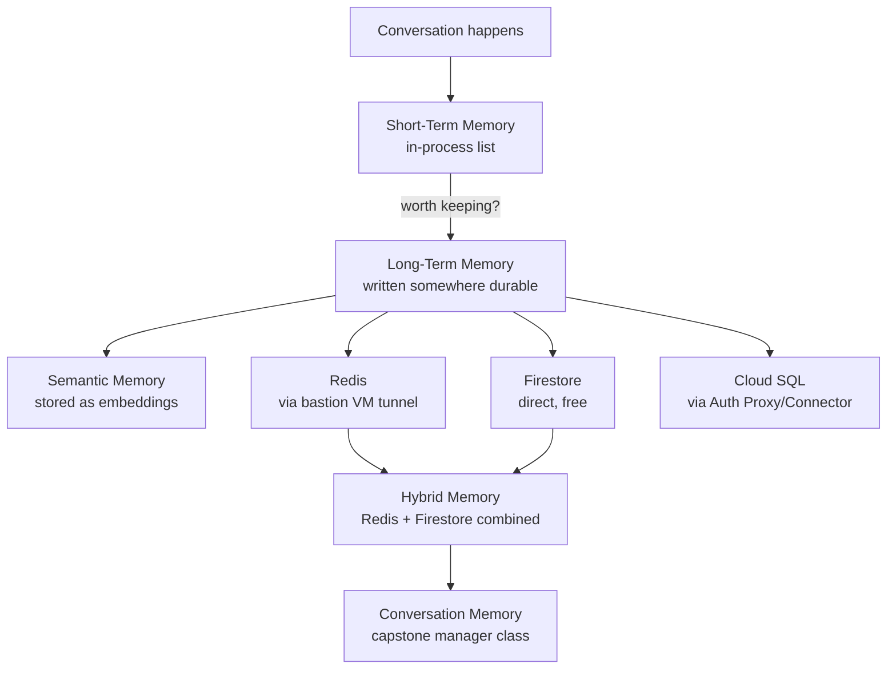

# Module 9 – Memory Systems

**Duration:** 3 hrs
**Goal:** By default, an LLM forgets everything the moment a conversation ends. This module is where you give your agents actual memory — short-term, long-term, and "remember by meaning" — using real GCP storage services.

> **A second, use-case-driven pass over these same 8 topics exists at [`docs/customer-support-agent/`](customer-support-agent/00-module-overview.md)** — same concepts, taught through one coherent scenario (an AI customer support agent) instead of generic examples. This page and its topic docs are kept as-is for backup/reference.

## Why this module exists

Every capstone project from here on needs an agent that remembers something: a user's preferences, facts from earlier in a conversation, or context retrieved by meaning rather than exact keywords. This module builds that from first principles — first the *concepts* (what kind of memory, and why), then the *storage backends* (Redis, Firestore, Cloud SQL) that actually implement it.

## Two threads running through this module

- **Concepts** (topics 1, 2, 3, 7, 8): what *kind* of memory an agent needs.
- **Storage backends** (topics 4, 5, 6): the actual GCP services you'd use to implement it.

## Topics (in teaching order)

| # | Topic | One-line focus |
|---|-------|-----------------|
| 1 | [Short-Term Memory](01-short-term-memory.md) | Remembering within one conversation — in-process, gone on restart |
| 2 | [Long-Term Memory](02-long-term-memory.md) | Remembering across sessions — needs to be written somewhere durable |
| 3 | [Semantic Memory](03-semantic-memory.md) | Recall by meaning, not exact text — embeddings again, self-contained here |
| 4 | [Redis](04-redis.md) | Fast, in-memory storage — and the networking quirk that makes it interesting |
| 5 | [Firestore](05-firestore.md) | Flexible, serverless, genuinely free-tier document storage |
| 6 | [Cloud SQL](06-cloud-sql.md) | Structured, relational storage — and why it's easier to reach than Redis |
| 7 | [Hybrid Memory](07-hybrid-memory.md) | Combining Redis (short-term) + Firestore (long-term) in one pattern |
| 8 | [Conversation Memory](08-conversation-memory.md) | Capstone: a reusable memory manager an agent could actually call |

## A note on isolation

This module's code is fully self-contained — it does **not** import from Module 3's code, even though topic 3 (Semantic Memory) uses the exact same embeddings API you learned there. Every module in this course stands alone; if you jump straight to Module 9 without building 4-8 first, everything here still works.

## A note on cost — read this before touching the console

Unlike every module before this one, two of the services here (**Memorystore Redis** and **Cloud SQL**) have **no free tier at all** — they bill by the hour, every hour they exist, trial credit or not. Firestore is the exception (genuinely free at this scale, forever). The rule for this module: **provision it, demo it, tear it down** — never leave Redis or Cloud SQL running after you're done. Topic 4 and topic 6 both end with a reminder; the teardown commands at the end of `commands.md` delete everything at once.

## The Redis networking wrinkle

Memorystore for Redis has **no public IP** — it only exists inside your VPC, by design. Cloud SQL, by contrast, is easy to reach securely from your laptop. To demo Redis live, we provision a small bastion VM in the same network and open an SSH tunnel through it — more setup than any other topic in the course so far, and a genuinely useful lesson about private-by-default networking. Full details in topic 4.

## How the pieces connect

## Prerequisites before starting

- Modules 2 and 3 complete: project + billing set up, comfortable with the `google-genai` SDK
- `pip install -r requirements.txt` (this module's own, per the isolation rule above)
- `.env` filled in (copy from `.env.example`)
- Comfortable opening two Command Prompt windows at once (needed for the Redis SSH tunnel in topic 4)

## What you'll be able to do after this module

Build an agent that remembers a conversation while it's happening, recalls facts across sessions, retrieves relevant memories by meaning instead of exact wording, and does all of it backed by real, production-grade GCP storage — cleanly torn down when you're done.
