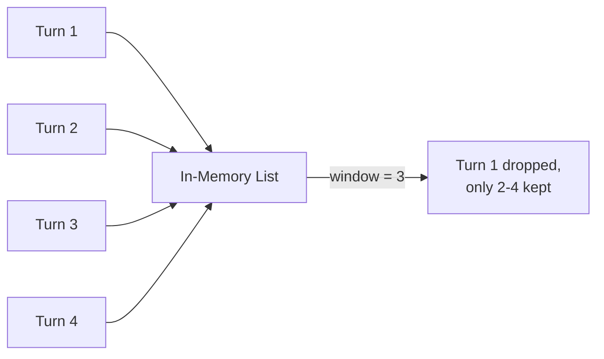

# 1. Short-Term Memory

## What Is It? (Plain English)

Short-term memory is what an agent remembers *within one conversation* — the last few things said, held in your program's memory while it runs. The moment the program stops, it's gone. That's not a limitation to fix; it's the whole point of calling it "short-term."

## Why It Matters for AI Engineers

Every chat-style agent needs this at minimum — without it, the model has no idea what you said two messages ago. It's also the cheapest, fastest kind of memory: no database, no network call, just a variable in your running program.

## Key Concepts

| Term | Meaning |
|------|---------|
| **In-Process Memory** | Data held in your program's own memory (RAM), not written anywhere external |
| **Conversation Turn** | One exchange — typically one user message + one model response |
| **Sliding Window** | Keeping only the last N turns, dropping the oldest as new ones arrive |
| **Context Window Pressure** | Why sliding windows exist — models can only "see" a limited amount of text at once (Module 3, topic 2) |

## How It Fits Together



## Hands-On

```python
# %%
class ShortTermMemory:
    def __init__(self, max_turns: int = 6):
        self.max_turns = max_turns
        self.turns: list[dict] = []

    def add(self, role: str, content: str):
        self.turns.append({"role": role, "content": content})
        self.turns = self.turns[-self.max_turns:]  # sliding window

    def as_context(self) -> str:
        return "\n".join(f"{t['role']}: {t['content']}" for t in self.turns)

# %%
memory = ShortTermMemory(max_turns=3)
memory.add("user", "My name is Divesh.")
memory.add("assistant", "Nice to meet you, Divesh!")
memory.add("user", "What's my name?")
print(memory.as_context())

# %%
# Push past the window — watch the oldest turn silently drop
memory.add("assistant", "Your name is Divesh.")
memory.add("user", "What's 2+2?")
print(memory.as_context())  # "My name is Divesh" is now gone
```

## Common Pitfalls

- Assuming short-term memory survives a process restart — it never does, by definition; that's what topic 2 solves.
- Forgetting to cap it — an unbounded conversation history eventually blows past the model's context window and either errors or gets silently truncated by the API.
- Treating this as "good enough" for facts that actually matter — anything worth remembering past this session belongs in long-term memory instead.

## Quick Recap

1. What makes memory "short-term" — the storage technology, or something else?
2. Why does a sliding window exist?
3. What happens to short-term memory when the program restarts?
