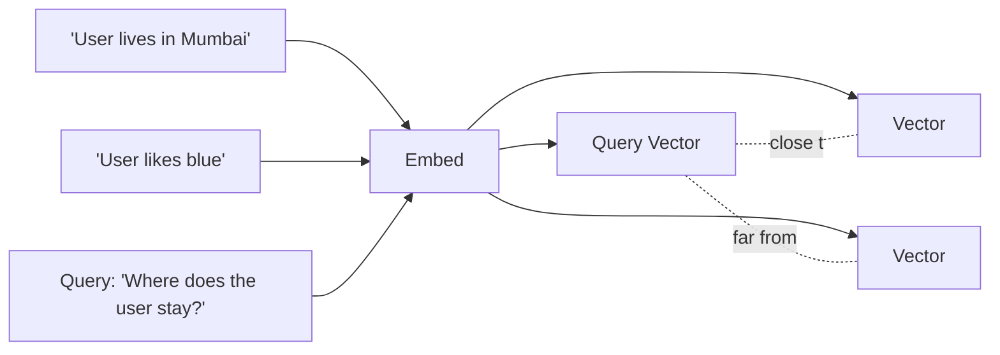

# 3. Semantic Memory

## What Is It? (Plain English)

Semantic memory means retrieving memories by *meaning*, not exact wording. "Where does the user live?" should be able to find a stored memory of "The user lives in Mumbai" even though the two sentences don't share a single meaningful word in common.

## Why It Matters for AI Engineers

Users don't phrase questions the same way twice. A memory system that only matches exact text is brittle in practice — semantic memory, built on embeddings (Module 3, topic 5), is what makes recall actually work the way a person would expect.

## Key Concepts

| Term | Meaning |
|------|---------|
| **Embedding** | A vector representing a piece of text's meaning (same concept as Module 3) |
| **Memory Store** | Here, just a list of (text, vector) pairs — a real system would use a vector database |
| **Cosine Similarity** | The math used to score how close a query's meaning is to a stored memory's meaning |
| **Top-k Retrieval** | Returning the k most similar memories, not just the single best match |

## How It Fits Together



## A note on isolation

This code is written fresh for this module — it does **not** import anything from `code/03-vertex-ai-gemini/`, even though it's the exact same embeddings API you already learned there. Every module in this course is self-contained.

## Hands-On

```python
# %%
import numpy as np
from setup import genai_client, EMBEDDING_MODEL

def embed(text: str) -> np.ndarray:
    result = genai_client.models.embed_content(model=EMBEDDING_MODEL, contents=[text])
    return np.array(result.embeddings[0].values)

def cosine_similarity(a, b):
    return np.dot(a, b) / (np.linalg.norm(a) * np.linalg.norm(b))

# %%
memories = [
    "The user's favorite color is blue.",
    "The user lives in Mumbai.",
    "The user is building a Udemy course on cloud AI.",
]
memory_vectors = [embed(m) for m in memories]

# %%
def recall(query: str, top_k: int = 1):
    query_vector = embed(query)
    scored = [(cosine_similarity(query_vector, v), m) for v, m in zip(memory_vectors, memories)]
    scored.sort(reverse=True)
    return scored[:top_k]

print(recall("Where does the user stay?"))
```

## Common Pitfalls

- Re-embedding every memory on every single query — in a real system, memories are embedded once when stored, and only the query is embedded at recall time.
- Assuming semantic memory replaces short-term/long-term memory — it doesn't, it's a *retrieval method* layered on top of durable storage (topics 5-6), which is exactly what topic 7 (Hybrid Memory) builds.
- Comparing embeddings from two different embedding models — same warning as Module 3: vectors from different models aren't compatible.

## Quick Recap

1. What problem does semantic memory solve that exact-text matching doesn't?
2. Why is this module's embeddings code written fresh instead of imported from Module 3?
3. When should a memory get embedded — at store time, or at query time?
