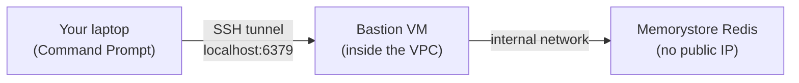

# 4. Redis

## What Is It? (Plain English)

Redis is an in-memory database — it stores data in RAM instead of on disk, which makes it extremely fast. On Google Cloud, the managed version is called **Memorystore for Redis**. It's a natural fit for short-term/session memory: fast reads and writes, with an optional expiry (TTL) so old data cleans itself up.

## Why It Matters for AI Engineers

Session-style memory — "what did this specific user say a moment ago" — needs to be fast and shared across however many instances of your agent are running (unlike topic 1's in-process list, which only one process can see). Redis is the standard tool for exactly this.

## Key Concepts

| Term | Meaning |
|------|---------|
| **Memorystore for Redis** | Google Cloud's managed Redis service |
| **TTL (Time To Live)** | An expiry you set on a key — Redis deletes it automatically after that time, perfect for session memory |
| **VPC-Internal Only** | Memorystore has **no public IP** — it only exists inside your Virtual Private Cloud network, by design |
| **Bastion Host** | A small VM inside the same network, used as a stepping stone to reach something otherwise unreachable from outside |
| **SSH Tunnel / Port Forwarding** | Using an SSH connection to a VM to securely forward a local port to something only that VM's network can see |

## How It Fits Together



## Why the extra setup — read this before the demo

Every other service in this course so far, you could call directly from your laptop. Redis is different: Memorystore has no public IP at all — it only exists inside a private network (a VPC). To reach it, you need something that's *already inside* that network to act as a bridge. That's the bastion VM. This isn't a course simplification — it's genuinely how teams reach Memorystore from outside GCP in real production setups too.

## Hands-On

**Step 1 — provision (one Command Prompt window):**
```bat
04a_provision_redis_and_bastion.bat
```
This creates the Redis instance and a small bastion VM, and prints the Redis instance's internal IP address.

**Step 2 — open the tunnel (a SECOND Command Prompt window, leave it running):**
```bat
gcloud compute ssh %BASTION_VM_NAME% --zone=%ZONE% -- -L 6379:REDIS_INTERNAL_IP:6379 -N
```
Replace `REDIS_INTERNAL_IP` with what step 1 printed. This window will look like it's "hanging" — that's correct, it's holding the tunnel open.

**Step 3 — back in the FIRST window, run the demo:**
```python
# %%
import redis

r = redis.Redis(host="localhost", port=6379, decode_responses=True)

# %%
r.set("session:demo-user:last_message", "Hello from Redis!")
r.expire("session:demo-user:last_message", 3600)  # auto-deletes after 1 hour

print(r.get("session:demo-user:last_message"))
print("TTL remaining (seconds):", r.ttl("session:demo-user:last_message"))
```

Your Python code talks to `localhost:6379` — the tunnel makes that transparently become the real Memorystore instance.

## Common Pitfalls

- Trying to connect directly to the Redis instance's internal IP from your laptop — this will simply time out, because your laptop isn't inside the VPC. The tunnel is not optional.
- Closing the second Command Prompt window (killing the tunnel) and then wondering why the Python script suddenly can't connect.
- Forgetting to set a TTL — without one, "short-term" data in Redis will happily sit there forever, still billing you.
- **Leaving the Redis instance or bastion VM running after the demo** — neither has a free tier; run `99_cleanup.bat` when done.

## Quick Recap

1. Why can't you connect to Memorystore directly from your laptop?
2. What two things does the bastion VM + SSH tunnel combination let you do?
3. What does setting a TTL on a Redis key accomplish, and why does it matter for session memory?
