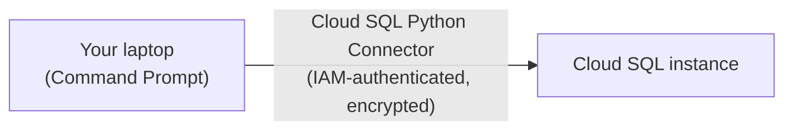

# 6. Cloud SQL

## What Is It? (Plain English)

Cloud SQL is Google Cloud's managed relational database — real tables, real rows, real SQL. For memory that has a genuinely structured shape (a `memories` table with a `user_id`, `fact`, and `created_at` column, say), this is the right tool.

## Why It Matters for AI Engineers

Some memory is naturally tabular — user profiles, structured preferences, anything you'd want to query with `WHERE` and `JOIN`. Cloud SQL also matters here for a second reason: it's the deliberate contrast to Redis. Both are "real infrastructure you provision," but only one of them is easy to reach securely from your laptop.

## Key Concepts

| Term | Meaning |
|------|---------|
| **Instance** | A running Cloud SQL database server — what you provision |
| **Cloud SQL Auth Proxy / Python Connector** | Google's tooling for connecting securely over the public internet using IAM, without exposing a raw public IP the way a normal database would |
| **Instance Connection Name** | The Cloud SQL identifier in the form `PROJECT_ID:REGION:INSTANCE_NAME`, used instead of a plain host/port |
| **`pg8000`** | A pure-Python PostgreSQL driver, used underneath the connector |

## How It Fits Together



Compare this to topic 4's diagram — no bastion VM, no manual tunnel. The Connector does the secure-connection work for you.

## Why this is easier than Redis — read this before the demo

Redis needed a bastion VM because Memorystore has no built-in secure way to reach it from outside the VPC. Cloud SQL ships exactly that capability out of the box: the **Cloud SQL Auth Proxy** (and its Python equivalent, the **Cloud SQL Python Connector**) opens an encrypted, IAM-authenticated connection over the public internet without ever exposing a raw database port. Same underlying problem (a private, provisioned database) — Cloud SQL just solved it for you, Memorystore didn't.

## Hands-On

**Step 1 — provision (kick this off back in topic 4, since it can be slow):** run the Cloud SQL commands in `commands.md` (Topic 6).

**Step 2 — connect and use it from Python:**
```python
# %%
import sqlalchemy
from google.cloud.sql.connector import Connector
from setup import PROJECT_ID, REGION, CLOUD_SQL_INSTANCE_NAME, CLOUD_SQL_DB_NAME, CLOUD_SQL_USER, CLOUD_SQL_PASSWORD

connector = Connector()

def getconn():
    return connector.connect(
        f"{PROJECT_ID}:{REGION}:{CLOUD_SQL_INSTANCE_NAME}",
        "pg8000",
        user=CLOUD_SQL_USER,
        password=CLOUD_SQL_PASSWORD,
        db=CLOUD_SQL_DB_NAME,
    )

engine = sqlalchemy.create_engine("postgresql+pg8000://", creator=getconn)

# %%
with engine.connect() as conn:
    conn.execute(sqlalchemy.text("""
        CREATE TABLE IF NOT EXISTS memories (
            id SERIAL PRIMARY KEY,
            user_id TEXT NOT NULL,
            fact TEXT NOT NULL
        )
    """))
    conn.commit()

# %%
with engine.connect() as conn:
    conn.execute(
        sqlalchemy.text("INSERT INTO memories (user_id, fact) VALUES (:user_id, :fact)"),
        {"user_id": "user_divesh", "fact": "Prefers Cloud SQL for structured memory"},
    )
    conn.commit()

    result = conn.execute(sqlalchemy.text("SELECT * FROM memories WHERE user_id = :uid"), {"uid": "user_divesh"})
    for row in result:
        print(row)
```

## Common Pitfalls

- Hardcoding the database password in code instead of `.env` — this is the first *real secret* (not just config) this course has handled; treat `CLOUD_SQL_PASSWORD` with the same care as a service account key.
- Forgetting the instance takes several minutes to provision — start it early (topic 4), never live-wait for it on camera.
- Modeling something naturally flexible/nested (like topic 5's per-user fact lists) as rigid SQL tables — that's Firestore's job; use Cloud SQL when the data is genuinely tabular.
- **Leaving the instance running after the demo** — no free tier; run the cleanup commands in `commands.md` when done.

## Quick Recap

1. What tool lets you connect to Cloud SQL securely from a laptop without a bastion VM?
2. Why is `CLOUD_SQL_PASSWORD` treated differently from the other `.env` values in this module?
3. When would you reach for Cloud SQL instead of Firestore for memory storage?
