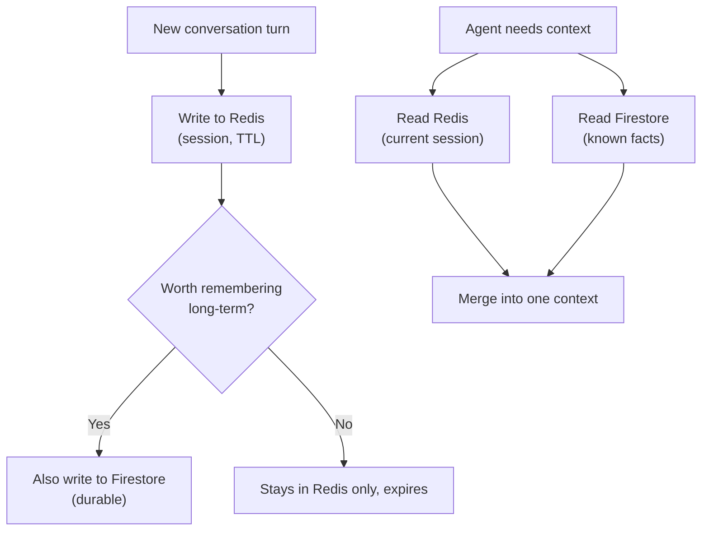

# 7. Hybrid Memory

## What Is It? (Plain English)

Hybrid memory means using more than one storage backend together, each doing the job it's best at — Redis for fast, short-lived session data, Firestore for durable, long-term facts. Not one database trying to do everything; two databases, each playing to its strength.

## Why It Matters for AI Engineers

Real agents almost never use a single memory store. A production chatbot might keep the current session in Redis (fast, auto-expiring) while writing anything worth remembering long-term into Firestore. Designing this well is a real architectural skill — this topic is where topics 4 and 5 finally meet.

## Key Concepts

| Term | Meaning |
|------|---------|
| **Hybrid Storage** | Using multiple databases together, each for what it does best |
| **Write-Through** | Writing to both stores at once (e.g., session cache + durable record) |
| **Promotion** | Moving something from short-term (Redis) into long-term (Firestore) once it's worth keeping |
| **Unified Read** | Merging results from multiple stores into one answer for the caller |

## How It Fits Together



## Hands-On

```python
# %%
import redis
from setup import firestore_client

r = redis.Redis(host="localhost", port=6379, decode_responses=True)  # tunnel from topic 4 still open
memories_ref = firestore_client.collection("long_term_memory")

# %%
def remember_turn(user_id: str, role: str, content: str):
    # short-term: session cache, expires in 1 hour
    key = f"session:{user_id}:turns"
    r.rpush(key, f"{role}: {content}")
    r.expire(key, 3600)

def remember_fact(user_id: str, fact: str):
    # long-term: durable, no expiry
    from google.cloud.firestore_v1 import ArrayUnion
    memories_ref.document(user_id).set({"facts": ArrayUnion([fact])}, merge=True)

# %%
remember_turn("user_divesh", "user", "Remind me I prefer Command Prompt.")
remember_fact("user_divesh", "Prefers Command Prompt over PowerShell")

# %%
def recall_context(user_id: str) -> str:
    session_turns = r.lrange(f"session:{user_id}:turns", 0, -1)
    facts_doc = memories_ref.document(user_id).get()
    facts = facts_doc.to_dict().get("facts", []) if facts_doc.exists else []

    return (
        "Recent session:\n" + "\n".join(session_turns) +
        "\n\nKnown facts:\n" + "\n".join(facts)
    )

print(recall_context("user_divesh"))
```

## Common Pitfalls

- Writing everything to both stores "to be safe" — defeats the purpose; short-lived chit-chat doesn't belong in durable storage, and durable facts shouldn't rely on a TTL-expiring cache.
- No clear rule for *when* something gets promoted from session to long-term — decide this deliberately (e.g., explicit facts the model extracts) rather than leaving it vague.
- Forgetting the Redis tunnel from topic 4 needs to still be open for this script to work.

## Quick Recap

1. What's the difference between hybrid memory and just picking one database?
2. What does "promotion" mean in this context?
3. Give one example of data that belongs only in Redis, and one that belongs only in Firestore.
