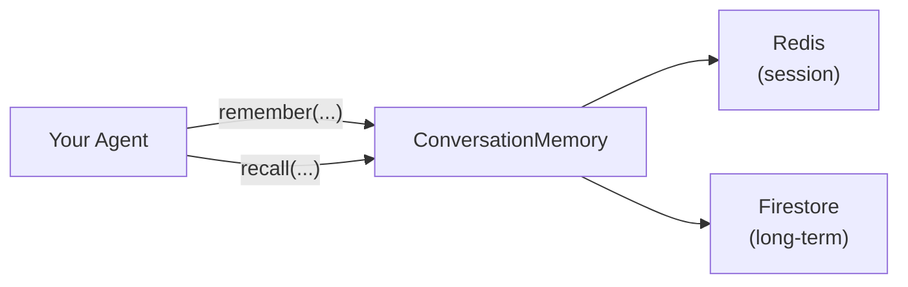

# 8. Conversation Memory

## What Is It? (Plain English)

Conversation memory is everything from this module, wrapped into one clean interface an agent can actually call — `remember()` and `recall()` — without needing to know Redis and Firestore are involved underneath.

## Why It Matters for AI Engineers

Nobody wants to sprinkle raw Redis and Firestore calls throughout their agent code. A well-designed memory class hides that complexity behind a simple interface, which is exactly the kind of building block every framework you'll learn later (LangChain, LangGraph, ADK) provides its own version of. Building one by hand here means you'll recognize — and be able to debug — the equivalent piece inside those frameworks.

## Key Concepts

| Term | Meaning |
|------|---------|
| **Interface** | The small set of methods callers actually use (`remember`, `recall`) — the rest is hidden |
| **Encapsulation** | Keeping the storage details (Redis, Firestore) private inside the class |
| **Memory Manager** | The general name for this pattern — a class responsible for all memory read/write for an agent |

## How It Fits Together



## Hands-On — the capstone

```python
# %%
import redis
from google.cloud.firestore_v1 import ArrayUnion
from setup import firestore_client

class ConversationMemory:
    def __init__(self, user_id: str, redis_host="localhost", redis_port=6379):
        self.user_id = user_id
        self.redis = redis.Redis(host=redis_host, port=redis_port, decode_responses=True)
        self.firestore_doc = firestore_client.collection("long_term_memory").document(user_id)
        self.session_key = f"session:{user_id}:turns"

    def remember_turn(self, role: str, content: str):
        self.redis.rpush(self.session_key, f"{role}: {content}")
        self.redis.expire(self.session_key, 3600)

    def remember_fact(self, fact: str):
        self.firestore_doc.set({"facts": ArrayUnion([fact])}, merge=True)

    def recall(self) -> str:
        turns = self.redis.lrange(self.session_key, 0, -1)
        doc = self.firestore_doc.get()
        facts = doc.to_dict().get("facts", []) if doc.exists else []
        return (
            "Recent session:\n" + "\n".join(turns) +
            "\n\nKnown facts:\n" + "\n".join(facts)
        )

# %%
memory = ConversationMemory(user_id="user_divesh")
memory.remember_turn("user", "I'm recording Module 9 right now.")
memory.remember_fact("Currently recording the Memory Systems module")

# %%
print(memory.recall())

# %%
# This is what an agent would actually do: fetch context, then call Gemini with it
context = memory.recall()
print("\n--- This is what would get passed into a Gemini prompt ---\n")
print(context)
```

## Common Pitfalls

- Exposing Redis/Firestore objects directly on the class instead of hiding them behind methods — defeats the point of building an interface at all.
- Not handling the case where a user has no long-term facts yet (`doc.exists` is False) — always guard for it, as shown above.
- Treating this toy class as production-ready — a real memory manager needs error handling, connection pooling, and probably async support (all fair topics for later modules); this version is deliberately minimal to keep the pattern visible.

## Quick Recap

1. What two methods does this module's `ConversationMemory` class expose to callers?
2. Why hide Redis and Firestore behind a class instead of calling them directly from agent code?
3. What would you need to add before this class is genuinely production-ready?
