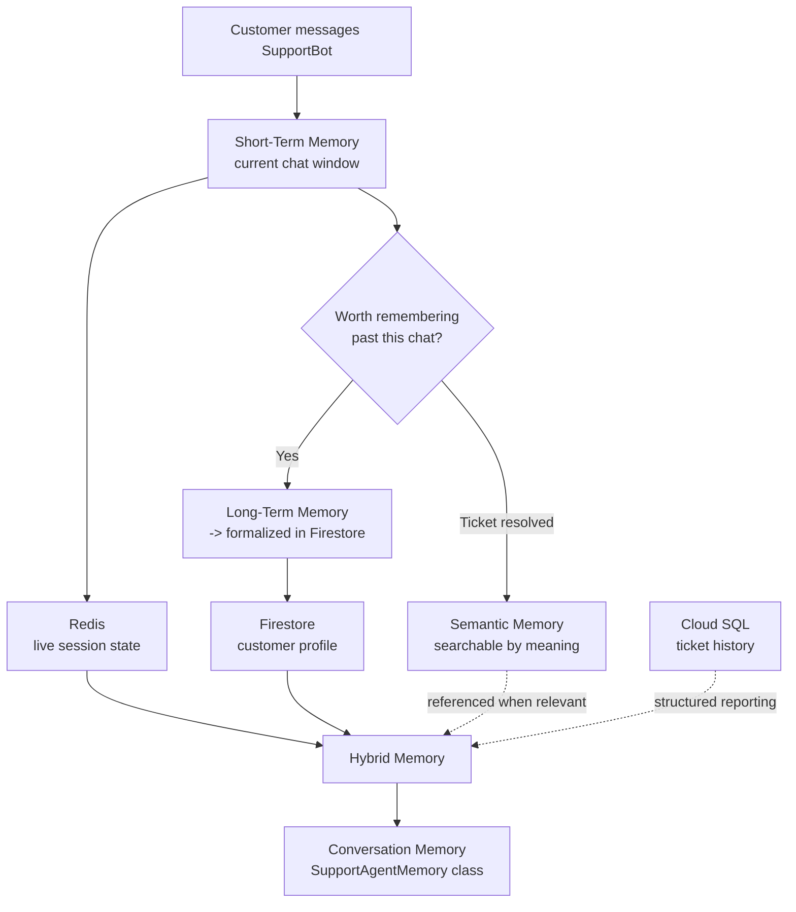

# Module 9 (Updated) – Memory Systems: SupportBot Edition

**This is a second, use-case-driven pass over Module 9's 8 topics — not a replacement.**
The original docs (`docs/*.md`) are kept for reference. The generic scripts they describe were removed as redundant with the notebooks. This folder teaches the same 8 concepts from scratch, through one coherent, realistic scenario instead of generic placeholder examples.

## The domain: SupportBot, an AI customer support agent

Every topic below is a piece of the same imagined product — a software company's AI support agent, handling a real, messy, multi-day customer interaction. Each memory type gets the specific job it's actually good at, so the "why this memory type, not another one" question has an obvious answer every time.

| # | Topic | SupportBot's use for it |
|---|-------|---------------------------|
| 1 | Short-Term Memory | The current chat — "it keeps crashing" only makes sense with the last few messages |
| 2 | Long-Term Memory | Remembering a returning customer's plan tier and past issues, across days |
| 3 | Semantic Memory | Finding a relevant past-resolved ticket by meaning, not exact wording |
| 4 | Memorystore (Redis) | Live session state for the chat — fast, ephemeral, gone when the chat ends |
| 5 | Firestore | The durable customer profile — flexible fields per customer |
| 6 | Cloud SQL | Structured ticket history — customers + tickets, joined for real reporting |
| 7 | Hybrid Memory | Combining live session (Redis) + known facts (Firestore) into one context |
| 8 | Conversation Memory | The full `SupportAgentMemory` class — the memory backbone a real agent would use |

## Why this is a separate scenario from other modules' storage demos

Module 13 (Storage for AI Applications) already used Firestore, Cloud SQL, and Redis for a *School AI Assistant* — general-purpose app storage. This module's demos are specifically about *agent memory*: what an agent needs to remember to hold a coherent conversation and act on what it knows about a specific user. Different question, different lens, even where the underlying GCP service is the same.

## Reuses the same infrastructure as the original Module 9 notebooks

No new Redis instance, no new Cloud SQL instance — these notebooks run against the exact same infrastructure, created by the commands in `commands.md`. It uses the names `support_customers`/`support_tickets`, `support_customer_profiles`, and `support_session:*` keys.

## How the pieces connect

## Format

Real Jupyter notebooks (matching Modules 7 and 13), one per topic — self-contained, loading `.env` from the parent `09-memory-systems/` folder rather than duplicating it.

## Prerequisites

Same as the original Module 9: Modules 2, 3 complete, `.env` filled in at the module root, and — for topics 4 and 6 — the same provisioning discipline (provision → demo → tear down with the commands in `commands.md`) already established there.
