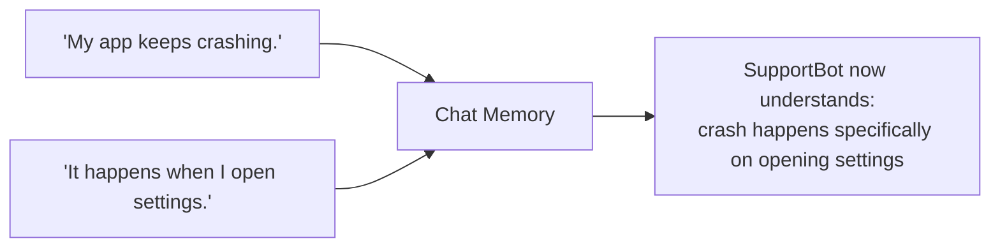

# 1. Short-Term Memory — SupportBot's Current Chat

## What Is It? (Plain English)

Short-term memory is what SupportBot remembers *within one active chat* — held in memory while the conversation is happening, gone the moment it ends. Same concept as the original Module 9 topic; this time with a scenario where it's obviously necessary.

## Why It Matters for AI Engineers

Watch this exchange fail without it: *"My app keeps crashing." "It happens when I open settings."* — "It" is meaningless without the previous message. Short-term memory is the minimum an agent needs to hold a coherent multi-turn conversation at all.

## Key Concepts

| Term | Meaning |
|------|---------|
| **In-Process Memory** | Held in RAM for the current chat session, not written anywhere durable |
| **Sliding Window** | Keep the last N turns, drop the oldest as new ones arrive |
| **Reference Resolution** | Understanding what "it," "that," "the same issue" refers to, using recent turns |

## How It Fits Together



## Hands-On

See `customer_support_agent/01_short_term_memory.ipynb`.

```python
class SupportChatMemory:
    def __init__(self, max_turns: int = 8):
        self.max_turns = max_turns
        self.turns: list[dict] = []

    def add(self, role: str, content: str):
        self.turns.append({"role": role, "content": content})
        self.turns = self.turns[-self.max_turns:]

    def as_context(self) -> str:
        return "\n".join(f"{t['role']}: {t['content']}" for t in self.turns)

chat = SupportChatMemory()
chat.add("customer", "My app keeps crashing.")
chat.add("agent", "Sorry to hear that! When does it happen?")
chat.add("customer", "It happens when I open settings.")
print(chat.as_context())
```

## Common Pitfalls

- Assuming this survives if the customer closes the chat and comes back later — it doesn't, by design; that's topic 2's job.
- No window limit — an unbounded chat history eventually exceeds what you can usefully send to the model.
- Treating "resolved" facts learned mid-chat as automatically saved long-term — nothing here writes anywhere durable; promotion to long-term memory (topic 2) has to be a deliberate step.

## Quick Recap

1. What breaks in the example conversation if short-term memory is missing?
2. What happens to this memory when the chat session ends?
3. What has to happen for something learned here to survive past this one chat?
