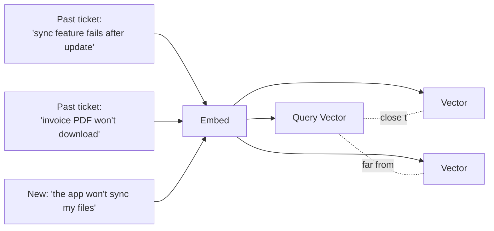

# 3. Semantic Memory — Finding a Similar Past Ticket

## What Is It? (Plain English)

Semantic memory means recalling something by *meaning*, not exact wording. A customer saying "the app won't sync my files" should be able to find a past resolved ticket titled "sync feature fails after update" — despite sharing almost no words in common.

## Why It Matters for AI Engineers

Customers never phrase things the way your knowledge base does. A support agent that only matches exact keywords will constantly miss relevant past resolutions that would have solved the problem in one message instead of ten.

## Key Concepts

| Term | Meaning |
|------|---------|
| **Embedding** | A vector capturing a ticket's meaning |
| **Ticket Memory Store** | Here, a list of (past ticket, vector) pairs |
| **Cosine Similarity** | The score used to find the most semantically similar past ticket |

## How It Fits Together



## Hands-On

See `customer_support_agent/03_semantic_memory.ipynb` — same embeddings API as the original module, written fresh, no cross-module or cross-scenario imports.

```python
import numpy as np
from setup import genai_client, EMBEDDING_MODEL

def embed(text: str) -> np.ndarray:
    result = genai_client.models.embed_content(model=EMBEDDING_MODEL, contents=[text])
    return np.array(result.embeddings[0].values)

def cosine_similarity(a, b):
    return np.dot(a, b) / (np.linalg.norm(a) * np.linalg.norm(b))

past_tickets = [
    "Sync feature fails after update",
    "Invoice PDF won't download",
    "App crashes on opening settings",
]
ticket_vectors = [embed(t) for t in past_tickets]

def find_similar_ticket(new_message: str, top_k: int = 1):
    query_vector = embed(new_message)
    scored = [(cosine_similarity(query_vector, v), t) for v, t in zip(ticket_vectors, past_tickets)]
    scored.sort(reverse=True)
    return scored[:top_k]

print(find_similar_ticket("the app won't sync my files"))
```

## Common Pitfalls

- Re-embedding the whole ticket archive on every new message — embed past tickets once when resolved, only the incoming message needs embedding at query time.
- Treating a semantic match as an automatic answer — it's a *candidate* resolution to reference, not something to paste back verbatim without checking it still applies.
- Mixing embeddings from different models in the same ticket store — same rule as every earlier embeddings topic.

## Quick Recap

1. Why would keyword search alone miss the sync/crashing example above?
2. When should a past ticket get embedded — when it's resolved, or when a new customer message arrives?
3. Should a semantically similar past ticket be treated as a guaranteed correct answer?
