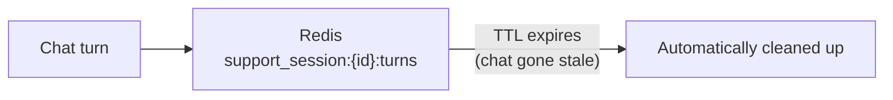

# 4. Memorystore (Redis) — Live Chat Session State

## What Is It? (Plain English)

Redis holds SupportBot's *live* session state — things like the running chat transcript for the current session — with speed that matters and a natural expiry once the chat is over. Same Memorystore service as the original Module 9 topic, same bastion-VM networking story; the *use* here is squarely session state, not caching an LLM call (that's Module 13's angle).

## Why It Matters for AI Engineers

A live support chat needs fast reads and writes, and — importantly — it shouldn't linger forever. A customer's session data isn't something you want sitting around in a database with no expiry once they've closed the tab.

## Key Concepts

| Term | Meaning |
|------|---------|
| **Memorystore for Redis** | Same as the original topic — no public IP, reached via bastion VM + SSH tunnel |
| **Session Key** | A key scoped to one chat session, e.g. `support_session:{session_id}:turns` |
| **TTL** | Session data auto-expires — no manual cleanup needed once the chat naturally goes stale |

## How It Fits Together



## Hands-On — reuses the exact same infrastructure as the original topic

Provisioning: `../04a_provision_redis_and_bastion.bat` (same instance, same bastion VM, same SSH tunnel — no new infra). See `code/09-memory-systems/customer_support_agent/04_redis_memory.ipynb`.

```python
import redis

r = redis.Redis(host="localhost", port=6379, decode_responses=True)

session_key = "support_session:sess_8842:turns"
r.rpush(session_key, "customer: My app keeps crashing.")
r.rpush(session_key, "agent: Sorry to hear that! When does it happen?")
r.expire(session_key, 1800)  # auto-expire after 30 minutes of the chat going stale

print(r.lrange(session_key, 0, -1))
print("Expires in (seconds):", r.ttl(session_key))
```

## Common Pitfalls

- Forgetting the SSH tunnel from the shared provisioning script needs to be open in its own window while this notebook runs.
- Setting no TTL — session data should expire; it's not meant to be permanent (that's Firestore's job, topic 5).
- Confusing this with Module 13's Redis use case — that one cached LLM *answers*; this one holds the live chat *session state*. Same service, genuinely different job.

## Quick Recap

1. Why does session data specifically benefit from a TTL?
2. What infrastructure does this topic reuse rather than re-provision?
3. How is this Redis use case different from Module 13's "cache the LLM's answer" use case?
