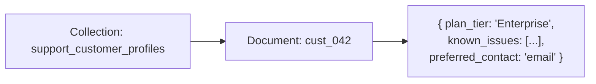

# 5. Firestore — The Durable Customer Profile

## What Is It? (Plain English)

Firestore is where SupportBot's long-term memory (topic 2) actually belongs in production — a real, flexible document store instead of a local file, holding each customer's durable facts.

## Why It Matters for AI Engineers

Every customer is a little different: some have a long list of known issues, some have none; some have extra fields like a preferred contact time. That per-customer variability is exactly what Firestore's flexible document shape is built for.

## Key Concepts

| Term | Meaning |
|------|---------|
| **Document** | One customer's profile |
| **Collection** | `support_customer_profiles` — deliberately different name from the original module's `long_term_memory` collection, so both can coexist |
| **`ArrayUnion`** | Adds a new known fact/issue without overwriting the rest of the profile |

## How It Fits Together



## Hands-On

See `code/09-memory-systems/customer_support_agent/05_firestore_memory.ipynb`.

```python
from setup import firestore_client
from google.cloud.firestore_v1 import ArrayUnion

profiles = firestore_client.collection("support_customer_profiles")

profiles.document("cust_042").set({
    "plan_tier": "Enterprise",
    "preferred_contact": "email",
    "known_issues": ["Billing issue resolved Jan 5"],
}, merge=True)

profiles.document("cust_042").update({
    "known_issues": ArrayUnion(["App crashes on opening settings - reported today"]),
})

print(profiles.document("cust_042").get().to_dict())
```

## Common Pitfalls

- Reusing the original module's `long_term_memory` collection name — this topic deliberately uses `support_customer_profiles` so both scenarios' data stay separate.
- Forgetting `merge=True` on `.set()` when only meaning to add a field — overwrites the whole profile otherwise.
- Storing the live chat transcript here instead of in Redis (topic 4) — that's ephemeral session data, this is durable customer-level facts. Different job.

## Quick Recap

1. Why is a customer profile a good fit for Firestore instead of a rigid table?
2. What collection name does this topic use, and why does it matter that it's different from the original module's?
3. What belongs in Firestore here versus what belongs in Redis?
