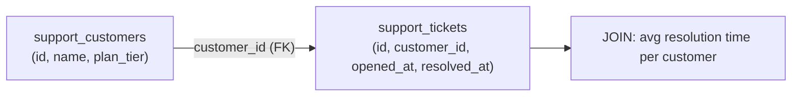

# 6. Cloud SQL — Structured Ticket History

## What Is It? (Plain English)

Cloud SQL stores SupportBot's actual ticket records — a genuinely relational shape: many tickets belong to one customer, and real reporting questions ("average resolution time," "how many tickets has this customer filed") need a `JOIN`.

## Why It Matters for AI Engineers

Firestore's customer profile (topic 5) is great for flexible facts about *one* customer. It's a poor fit for cross-customer analytical questions. Ticket history is exactly the kind of data that wants real relational structure.

## Key Concepts

| Term | Meaning |
|------|---------|
| **`support_customers` / `support_tickets`** | Two related tables — deliberately different names from the original module's `memories` table |
| **Foreign Key** | `support_tickets.customer_id` references `support_customers.id` |
| **`JOIN`** | Combines both tables to answer questions across the relationship |

## How It Fits Together



## Hands-On — reuses the exact same Cloud SQL instance as the original topic

Provisioning: `../06a_provision_cloud_sql.bat` (same instance, different table names). See `code/09-memory-systems/customer_support_agent/06_cloud_sql_memory.ipynb`.

```python
# Same Cloud SQL Python Connector pattern as the original topic
with engine.connect() as conn:
    conn.execute(sqlalchemy.text("""
        CREATE TABLE IF NOT EXISTS support_customers (
            id SERIAL PRIMARY KEY, name TEXT, plan_tier TEXT
        )
    """))
    conn.execute(sqlalchemy.text("""
        CREATE TABLE IF NOT EXISTS support_tickets (
            id SERIAL PRIMARY KEY,
            customer_id INT REFERENCES support_customers(id),
            opened_at TIMESTAMP,
            resolved_at TIMESTAMP
        )
    """))
    conn.commit()

# ...insert sample rows, then:
result = conn.execute(sqlalchemy.text("""
    SELECT c.name, AVG(EXTRACT(EPOCH FROM (t.resolved_at - t.opened_at)) / 3600) AS avg_hours
    FROM support_customers c JOIN support_tickets t ON c.id = t.customer_id
    WHERE t.resolved_at IS NOT NULL
    GROUP BY c.name
"""))
```

## Common Pitfalls

- Trying to answer "average resolution time across all customers" against Firestore — this is precisely the aggregation Cloud SQL exists for.
- Reusing the original topic's `memories` table name — this scenario uses `support_customers`/`support_tickets` on purpose, so both can coexist.
- Leaving the instance running after the demo — no free tier, same as the original topic; `../99_cleanup.bat` still applies.

## Quick Recap

1. Why is ticket history a better fit for Cloud SQL than Firestore?
2. What does the foreign key in `support_tickets` actually enforce?
3. Does this topic provision a new Cloud SQL instance, or reuse the existing one?
