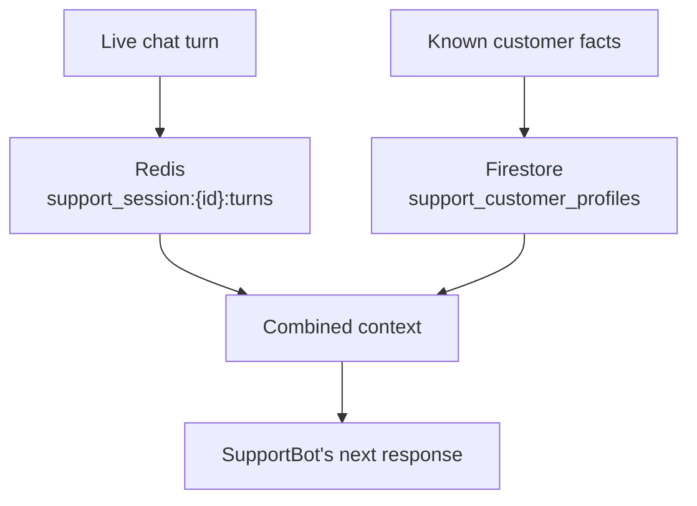

# 7. Hybrid Memory — The Live Chat Meets What We Know

## What Is It? (Plain English)

Hybrid memory combines Redis (the live session, topic 4) and Firestore (the durable customer profile, topic 5) into one combined context — what's happening *right now* plus what SupportBot already knows about this customer.

## Why It Matters for AI Engineers

A real support response needs both: "the customer just said X" (session) and "this customer is on the Enterprise plan and had a billing issue last month" (profile). Neither alone is enough.

## Key Concepts

| Term | Meaning |
|------|---------|
| **Hybrid Storage** | Redis + Firestore, each doing what it's best at |
| **Unified Read** | Merging both sources into one context block before calling the model |
| **Promotion** | Deciding a fact from the live chat is worth writing into the durable profile |

## How It Fits Together



## Hands-On

See `customer_support_agent/07_hybrid_memory.ipynb`.

```python
def get_support_context(session_id: str, customer_id: str) -> str:
    session_turns = r.lrange(f"support_session:{session_id}:turns", 0, -1)
    profile_doc = profiles.document(customer_id).get()
    profile = profile_doc.to_dict() if profile_doc.exists else {}

    return (
        "Current chat:\n" + "\n".join(session_turns) +
        f"\n\nCustomer profile: plan={profile.get('plan_tier', 'unknown')}, "
        f"known issues={profile.get('known_issues', [])}"
    )

print(get_support_context("sess_8842", "cust_042"))
```

## Common Pitfalls

- Writing every live chat turn into Firestore "to be safe" — defeats the purpose of having two tiers; only promote facts actually worth keeping past this chat.
- No clear rule for what gets promoted — decide deliberately (e.g., the agent explicitly flags a fact as worth remembering) rather than leaving it vague.
- Forgetting the Redis tunnel from topic 4 needs to still be open for this notebook to work.

## Quick Recap

1. What does the combined context give SupportBot that either source alone wouldn't?
2. What's the difference between session data and promoted long-term facts?
3. Who decides when something gets promoted from session to profile?
