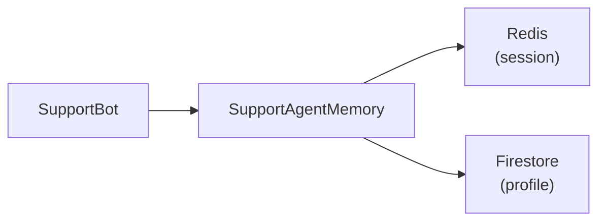

# 8. Conversation Memory — The SupportAgentMemory Class

## What Is It? (Plain English)

Everything from topics 1-7, wrapped into one clean class a real support agent could actually call — `remember_turn()`, `remember_fact()`, `recall()` — hiding Redis and Firestore behind a simple interface.

## Why It Matters for AI Engineers

This is the capstone of the memory story: nobody wants raw Redis and Firestore calls scattered through agent code. A well-designed memory manager is exactly the kind of building block every framework (LangChain, LangGraph, ADK) provides its own version of — building one by hand here means recognizing (and being able to debug) the equivalent piece inside those frameworks later.

## Key Concepts

| Term | Meaning |
|------|---------|
| **Interface** | The small set of methods callers actually use |
| **Encapsulation** | Redis/Firestore details stay private inside the class |
| **Memory Manager** | The general pattern — one class responsible for all of an agent's memory read/write |

## How It Fits Together



## Hands-On — the capstone

See `code/09-memory-systems/customer_support_agent/08_conversation_memory.ipynb`.

```python
class SupportAgentMemory:
    def __init__(self, session_id: str, customer_id: str, redis_host="localhost", redis_port=6379):
        self.session_id = session_id
        self.customer_id = customer_id
        self.redis = redis.Redis(host=redis_host, port=redis_port, decode_responses=True)
        self.profile_doc = firestore_client.collection("support_customer_profiles").document(customer_id)
        self.session_key = f"support_session:{session_id}:turns"

    def remember_turn(self, role: str, content: str):
        self.redis.rpush(self.session_key, f"{role}: {content}")
        self.redis.expire(self.session_key, 1800)

    def remember_fact(self, fact: str):
        self.profile_doc.set({"known_issues": ArrayUnion([fact])}, merge=True)

    def recall(self) -> str:
        turns = self.redis.lrange(self.session_key, 0, -1)
        profile = self.profile_doc.get().to_dict() or {}
        return (
            "Current chat:\n" + "\n".join(turns) +
            f"\n\nKnown issues: {profile.get('known_issues', [])}"
        )

memory = SupportAgentMemory(session_id="sess_9001", customer_id="cust_042")
memory.remember_turn("customer", "My app keeps crashing when I open settings.")
memory.remember_fact("App crashes on opening settings - reported today")
print(memory.recall())
```

## Common Pitfalls

- Exposing the Redis/Firestore objects directly instead of hiding them behind methods — defeats the point of building the interface.
- Not handling a brand-new customer with no profile yet (`profile_doc.get().to_dict()` returning `None`) — always guard for it.
- Treating this as production-ready as-is — a real version needs error handling, connection pooling, and probably async support; this stays deliberately minimal to keep the pattern visible.

## Quick Recap

1. What two methods does `SupportAgentMemory` expose to the rest of the agent?
2. Why hide Redis and Firestore behind a class instead of calling them directly?
3. What would need to be added before this is genuinely production-ready?
