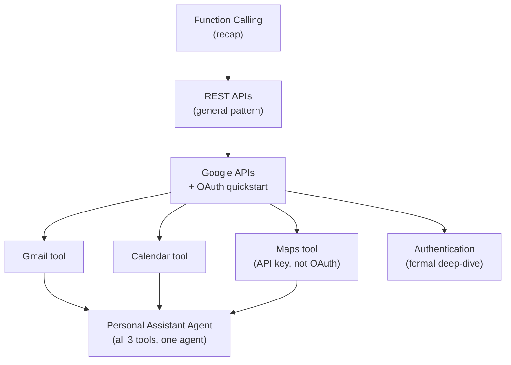

# Module 11 – Tool Calling & Integrations

**Duration:** 3 hrs
**Goal:** Give an agent access to real-world services — actual email, an actual calendar, actual locations — instead of just internal tools like search. By the end, you'll have a **Personal Assistant Agent** that can check your availability, schedule a meeting, and email people the details, all in one request.

## Why this module exists

Every tool you've built so far (Module 9's memory, Module 10's HR search) lived inside your own system. This module is about the other half of function calling: reaching *outside* your system into real Google services. That's also where authentication stops being simple — Gmail and Calendar act *as you*, which needs a different kind of permission than anything used so far in this course.

## Topics (in teaching order)

| # | Topic | One-line focus |
|---|-------|-----------------|
| 1 | [Function Calling](01-function-calling.md) | Quick recap — you already know this |
| 2 | [REST APIs](02-rest-apis.md) | The general pattern for calling any external API as a tool |
| 3 | [Google APIs](03-google-apis.md) | The shared client pattern + the OAuth setup every later topic depends on |
| 4 | [Gmail API](04-gmail-api.md) | Read/send email as an agent tool |
| 5 | [Calendar API](05-calendar-api.md) | Check availability / create events as an agent tool |
| 6 | [Maps API](06-maps-api.md) | Geocoding/directions — and a contrast in auth style (API key, not OAuth) |
| 7 | [Authentication](07-authentication.md) | The formal deep-dive: API keys vs. OAuth vs. service accounts, compared |

## A note on topic order (same pattern as Modules 3 and 10)

Gmail and Calendar (topics 4-5) need OAuth user-consent to work, but "Authentication" — the topic that formally explains it — is #7, last. Same resolution as before: topic 3 gets a practical OAuth *quickstart* (just enough to unblock topics 4-5), and topic 7 is the real deep-dive, comparing every auth pattern this module used.

## A one-time manual step you'll need to do yourself

Unlike anything earlier in this course, Gmail and Calendar need a **one-time browser consent step** — you personally click "Allow" once, in a real browser, before any code can act on your account. This can't be scripted or automated. **Topic 3's doc has the full, detailed, step-by-step walkthrough** (Google Cloud Console screens included) — do this once, before recording, the same way you'd pre-provision Cloud SQL in Module 9.

## The project: Personal Assistant Agent

Same shape as Module 10's HR assistant — one real project, built incrementally, LangChain-based, fully self-contained in this module's own `code/11-tool-calling-integrations/` folder (no imports from Module 10). Each topic (4, 5, 6) builds one tool; the module closes with a single agent holding all three, able to handle a request like:

> "Check if I'm free Thursday at 3pm. If so, schedule a team meeting, and email everyone the office address with directions."

One agent, three real tools, chained automatically — not three separate demos. (Multi-agent orchestration — splitting this into a Gmail agent + Calendar agent + Maps agent with a supervisor — is deliberately saved for the LangGraph module, which is built for exactly that.)

## How the pieces connect

## Prerequisites before starting

- Modules 2, 3, and 10 complete (comfortable with function calling and LangChain's `create_agent`)
- A Google account you're comfortable testing with (Gmail/Calendar will act on this real account, in a sandboxed way — see topic 3 for how test users work)
- `.env` filled in (see `code/11-tool-calling-integrations/.env.example`) — Maps needs an API key, Gmail/Calendar need a `client_secret.json` from the Console

## What you'll be able to do after this module

Wire any REST API into an agent as a tool, understand exactly which Google auth pattern to reach for and why (API key vs. OAuth vs. service account), and have a working assistant that can act on a real inbox and calendar — safely, and only with the specific permissions you explicitly granted it.
