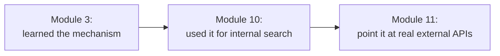

# 1. Function Calling (Recap)

## What Is It? (Plain English)

A quick reminder before we go further: function calling is how Gemini asks your code to run something — a function you defined — instead of just replying with text. You built this mechanism in Module 3 and used it for real in Module 10's HR assistant. Nothing new here conceptually; this module is about pointing that same mechanism at the *outside world*.

## Why It Matters for AI Engineers

Everything from here on — Gmail, Calendar, Maps — is "just" a function call, the same shape you already know. The only new material this module adds is: what does the function actually *do* when it runs (call a real API), and how does it prove it's allowed to (authentication).

## Key Concepts (Recap Table)

| Term | Reminder |
|------|----------|
| **Function Declaration** | The description you give the model — name, purpose, parameters |
| **Tool** | The general term for something a model can be given access to call |
| **The Model Never Executes Code** | It only requests a call; your code decides whether to actually run it |
| **`@tool`** | LangChain's decorator for turning a Python function into something an agent can call (used throughout Module 10, used again here) |

## How It Fits Together



## Hands-On

```python
# %%
from langchain.tools import tool

@tool
def add_numbers(a: int, b: int) -> int:
    """Add two numbers together."""
    return a + b

print(add_numbers.name, add_numbers.description)
```

If this looks completely familiar, good — that's the point of a recap topic.

## Common Pitfalls

- Treating this as new material and re-explaining function calling from scratch — resist the urge, keep it short.
- Forgetting that everything from topic 2 onward still follows this exact same request → tool call → result → response loop, just with real APIs on the other end.

## Quick Recap

1. In one sentence, what does function calling let a model do?
2. Does the model ever run your function itself?
3. What's genuinely new in this module, compared to what you already know about function calling?
