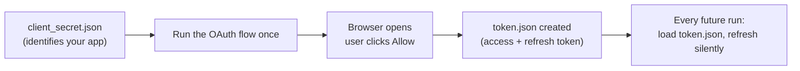

# 3. Google APIs

## What Is It? (Plain English)

Google wraps most of its APIs (Gmail, Calendar, Drive, Sheets, and more) in one shared Python pattern: `google-api-python-client`. Once you understand this one pattern, you can talk to almost any Google API the same way. The one thing that's new here — and different from every earlier module — is **OAuth 2.0 user consent**: Gmail and Calendar need to act *as a specific human*, which means that human has to explicitly approve it, once, in a browser.

## Why It Matters for AI Engineers

This is the first time in the course your code needs to act *as a person* instead of as a service account or with a simple API key. Getting this auth model right — understanding what it's for and doing the one-time setup correctly — unblocks everything in topics 4 and 5.

## Key Concepts

| Term | Meaning |
|------|---------|
| **OAuth 2.0** | A protocol for a user to grant an app limited, specific permission to act on their behalf, without ever sharing their password |
| **Scope** | The specific permission being requested, e.g. "send email" but not "read all my email" |
| **Consent Screen** | The one-time browser page where the user reviews and approves what's being requested |
| **`client_secret.json`** | A credential file identifying *your app* to Google — download this, never commit it |
| **`token.json`** | Created after the user approves once — holds the access + refresh token so you don't need to click "Allow" every single run |
| **Refresh Token** | Lets your app get new short-lived access tokens automatically, without repeating the consent screen |

## How It Fits Together



## Step-by-Step: One-Time Google Cloud Console Setup

Do this once, before recording, on your own machine. Every screen below is in `console.cloud.google.com`, using the same project from Module 2.

### Step 1 — Enable the APIs

1. Go to **APIs & Services → Library**
2. Search for **Gmail API**, click it, click **Enable**
3. Search for **Google Calendar API**, click it, click **Enable**

*(Or from a terminal: `gcloud services enable gmail.googleapis.com calendar-json.googleapis.com` — this is exactly what `commands.md` runs.)*

### Step 2 — Configure the OAuth Consent Screen

1. Go to **APIs & Services → OAuth consent screen**
2. Choose **External** as the User Type (this is fine even for personal testing — it just means "not restricted to a Google Workspace organization")
3. Fill in the required fields: App name (e.g., "Personal Assistant Agent"), your email as the support email, your email again as developer contact
4. On the **Scopes** step, you can skip adding scopes here — the code itself will request the specific scopes it needs
5. On the **Test users** step, click **Add Users** and add your own Gmail address. While the app is in "Testing" mode (the default, and totally fine for this course), only test users you explicitly list can use it
6. Save and continue through to finish

### Step 3 — Create an OAuth Client ID

1. Go to **APIs & Services → Credentials**
2. Click **Create Credentials → OAuth client ID**
3. Application type: **Desktop app** (this matters — it's what allows the local-browser consent flow the code uses)
4. Give it a name (e.g., "personal-assistant-desktop"), click **Create**
5. Click **Download JSON** on the credential you just created

### Step 4 — Place the Credential File

1. Rename the downloaded file to `client_secret.json`
2. Move it into this module's folder (`11-tool-calling-integrations/`, next to `main.py`)
3. **Never commit this file** — it's already covered by this repo's `.gitignore`, same treatment as Module 2's `key.json`

### Step 5 — Run the One-Time Consent Flow

```bash
./.venv/bin/python 03_google_apis_oauth_setup.py
```

This opens your default browser, shows the Google consent screen, and asks you to pick your account and click **Allow**. Once you do, `token.json` is created in the same folder — **that** file is what topics 4 and 5 actually use going forward. You will not need to click "Allow" again unless you delete `token.json` or the scopes change.

Two things to expect on a real run:

- If the consent screen already has an app name (this project's was "LUXE"), that name is what you'll see, because there is one consent screen per project. It's only a label.
- **"Access blocked ... can only be accessed by developer-approved testers" (Error 403: access_denied)** means your account isn't on the consent screen's **Audience → Test users** list yet. Add it there and re-run this step.

One caveat to the "won't need to click Allow again" promise: Google typically expires refresh tokens after 7 days for External apps left in Testing mode. If a later run fails with `invalid_grant`, delete `token.json` and repeat this step.

## Hands-On (the code side)

```python
# %%
# See 03_google_apis_oauth_setup.py for the full runnable version.
from google_auth_oauthlib.flow import InstalledAppFlow

SCOPES = [
    "https://www.googleapis.com/auth/gmail.readonly",
    "https://www.googleapis.com/auth/gmail.send",
    "https://www.googleapis.com/auth/calendar",
]

flow = InstalledAppFlow.from_client_secrets_file("client_secret.json", SCOPES)
creds = flow.run_local_server(port=0)  # opens the browser, waits for you to click Allow

with open("token.json", "w") as f:
    f.write(creds.to_json())
```

## Common Pitfalls

- Choosing **Web application** instead of **Desktop app** for the OAuth Client ID — the local-browser consent flow used here specifically expects a Desktop app credential.
- Forgetting to add yourself as a test user — without it, Google blocks the consent screen entirely while the app is in Testing mode.
- Committing `client_secret.json` or `token.json` to git — treat both exactly like Module 2's service account key file.
- Requesting broader scopes than you need "just in case" — same least-privilege lesson as every earlier module's IAM/service account topics.

## Quick Recap

1. What's the difference between `client_secret.json` and `token.json`?
2. Why does the OAuth Client ID need to be a "Desktop app" type for this course's setup?
3. What does adding yourself as a "test user" actually unlock?
