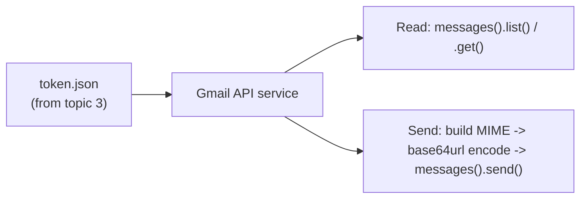

# 4. Gmail API

## What Is It? (Plain English)

The Gmail API lets code read and send email on behalf of a Gmail account — the exact account that clicked "Allow" during topic 3's one-time setup.

## Why It Matters for AI Engineers

"Draft and send this email for me" is one of the most requested real-world agent capabilities. Wiring it up correctly — and safely, with the narrowest scope that does the job — is directly reusable in almost any assistant you'll build.

## Key Concepts

| Term | Meaning |
|------|---------|
| **`gmail.readonly` scope** | Permission to read messages, not send or delete them |
| **`gmail.send` scope** | Permission to send messages, nothing else |
| **MIME Message** | The standard email format — headers (To, Subject) plus a body |
| **Base64url Encoding** | Gmail's API requires the raw MIME message encoded this way before sending |
| **`userId="me"`** | Gmail API shorthand meaning "the authenticated user" |

## How It Fits Together



## Hands-On

```python
# %%
from personal_assistant.auth import get_credentials
from googleapiclient.discovery import build

creds = get_credentials()
gmail_service = build("gmail", "v1", credentials=creds)

# %%
# Read the 3 most recent messages
results = gmail_service.users().messages().list(userId="me", maxResults=3).execute()
for msg in results.get("messages", []):
    detail = gmail_service.users().messages().get(userId="me", id=msg["id"]).execute()
    print(detail["snippet"])

# %%
# Send a message
import base64
from email.mime.text import MIMEText

message = MIMEText("This is a test email sent by the Personal Assistant Agent.")
message["to"] = "your-test-address@example.com"
message["subject"] = "Test from Module 11"

encoded = base64.urlsafe_b64encode(message.as_bytes()).decode()
gmail_service.users().messages().send(userId="me", body={"raw": encoded}).execute()
print("Sent!")
```

## Common Pitfalls

- Sending plain text without MIME + base64url encoding — the Gmail API will reject it; this exact encoding step is required.
- Requesting the full `gmail.modify` or account-wide scope when `gmail.send` + `gmail.readonly` cover everything this module needs — always scope to the minimum.
- Testing by sending real emails to real contacts — use a test address you control (or your own inbox) during development.

## Quick Recap

1. What two scopes does this topic use, and what does each allow?
2. Why does an email need to be base64url-encoded before sending via the API?
3. What does `userId="me"` refer to?
