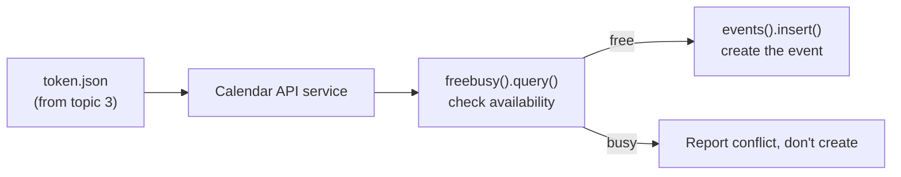

# 5. Calendar API

## What Is It? (Plain English)

The Calendar API lets code check when someone's free and create events on their behalf — the two operations that matter most for a scheduling assistant.

## Why It Matters for AI Engineers

"Am I free Thursday? If so, book it" is a two-step reasoning task that's a great showcase for function calling — the agent has to call one tool (check availability), look at the result, and *decide* whether to call a second tool (create the event).

## Key Concepts

| Term | Meaning |
|------|---------|
| **`calendar` scope** | Full read/write access to calendars — what this topic uses |
| **Freebusy Query** | Ask "is this calendar busy between time X and time Y" without seeing event details |
| **Event Resource** | The JSON structure describing an event — summary, start, end, attendees |
| **RFC3339 Timestamp** | The exact, timezone-aware datetime format the Calendar API requires (e.g., `2026-08-01T15:00:00+05:30`) |

## How It Fits Together



## Hands-On

```python
# %%
from personal_assistant.auth import get_credentials
from googleapiclient.discovery import build
from datetime import datetime, timedelta

creds = get_credentials()
calendar_service = build("calendar", "v3", credentials=creds)

# %%
# Check free/busy for the next hour
now = datetime.utcnow()
body = {
    "timeMin": now.isoformat() + "Z",
    "timeMax": (now + timedelta(hours=1)).isoformat() + "Z",
    "items": [{"id": "primary"}],
}
freebusy = calendar_service.freebusy().query(body=body).execute()
busy_slots = freebusy["calendars"]["primary"]["busy"]
print("Busy slots:", busy_slots)

# %%
# If free, create a test event
if not busy_slots:
    event = {
        "summary": "Team Meeting (Module 11 demo)",
        "start": {"dateTime": now.isoformat(), "timeZone": "UTC"},
        "end": {"dateTime": (now + timedelta(minutes=30)).isoformat(), "timeZone": "UTC"},
    }
    created = calendar_service.events().insert(calendarId="primary", body=event).execute()
    print("Created:", created.get("htmlLink"))
```

## Common Pitfalls

- Using a naive datetime (no timezone) — the Calendar API expects RFC3339 timestamps with an explicit timezone; ambiguous times cause silent scheduling bugs.
- Skipping the freebusy check and just creating events blindly — double-booking is exactly the failure mode this two-step pattern exists to prevent.
- Forgetting `calendarId="primary"` refers to the authenticated user's main calendar, not a fixed literal calendar name.

## Quick Recap

1. What are the two Calendar operations this topic covers?
2. Why does the agent need to check freebusy *before* creating an event, not after?
3. What format must Calendar API timestamps be in?
