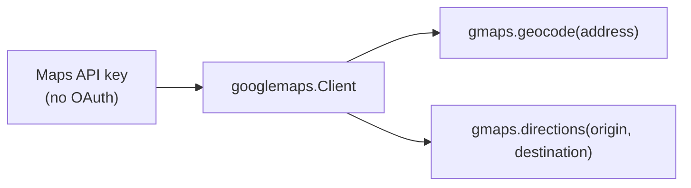

# 6. Maps API

## What Is It? (Plain English)

Google Maps Platform lets code look up addresses (geocoding) and get directions between two places. Unlike Gmail and Calendar, it doesn't touch anyone's private data — so it uses a much simpler auth model: a plain API key.

## Why It Matters for AI Engineers

This topic exists partly for its own sake (location lookup is a genuinely useful agent tool) and partly to break an assumption topics 3-5 might have built: **not every Google API needs OAuth.** Public, non-personal data just needs a key.

## Key Concepts

| Term | Meaning |
|------|---------|
| **Maps Platform API Key** | A single key, tied to your GCP project, that authenticates Maps requests |
| **Key Restrictions** | Limiting a key to specific APIs (and optionally IPs/referrers) — good practice, covered more in topic 7 |
| **Geocoding** | Converting an address into coordinates (and vice versa) |
| **Directions** | Getting a route (and travel time) between two points |

## How It Fits Together



## Hands-On

```python
# %%
import googlemaps
from personal_assistant.config import MAPS_API_KEY

gmaps = googlemaps.Client(key=MAPS_API_KEY)

# %%
geocode_result = gmaps.geocode("1600 Amphitheatre Parkway, Mountain View, CA")
print(geocode_result[0]["formatted_address"])
print(geocode_result[0]["geometry"]["location"])

# %%
directions_result = gmaps.directions(
    "Golden Gate Bridge, San Francisco, CA",
    "Fisherman's Wharf, San Francisco, CA",
    mode="walking",
)
print(directions_result[0]["legs"][0]["duration"]["text"])
```

## Common Pitfalls

- Creating an unrestricted API key — always restrict it to just the APIs you're using (Geocoding, Directions), same least-privilege habit as everywhere else in this course.
- Assuming this needs the same `token.json`/OAuth setup as topics 4-5 — it doesn't; a plain API key in `.env` is all this topic needs.
- Forgetting Maps Platform requires billing enabled on the project, even though usage at this scale is typically covered by the free monthly credit Google provides.

## Quick Recap

1. Why doesn't the Maps API need OAuth the way Gmail and Calendar do?
2. What's the difference between geocoding and directions?
3. What's one good security habit to apply to any Maps API key?
