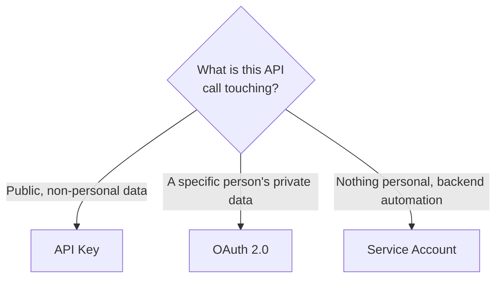

# 7. Authentication

## What Is It? (Plain English)

This module used three different ways to prove "I'm allowed to do this" — a plain API key (Maps), OAuth user consent (Gmail, Calendar), and (from earlier modules) service accounts. This topic formally compares all three: what each is for, and why picking the right one is a security decision, not a formality.

## Why It Matters for AI Engineers

Choosing the wrong auth pattern is a real security mistake, not just a style choice — using a broad, always-on credential where a narrow, revocable one would do is exactly the kind of thing that turns a minor bug into a real incident. This ties directly back to Module 2's IAM lesson and forward to Module 19's governance/security content.

## Key Concepts

| Term | Meaning |
|------|---------|
| **API Key** | A single, simple credential for accessing public, non-personal data (Maps) |
| **OAuth 2.0 (User Consent)** | A human explicitly grants your app specific, revocable permission to act as them (Gmail, Calendar) |
| **Service Account** | A "robot" identity your code authenticates as, acting as itself, not as any particular human (used throughout Modules 2-3, 9-10) |
| **Scope** | The specific, narrow permission requested — the lever for least-privilege in both OAuth and service accounts |
| **Credential Storage** | Where the proof of auth lives after the fact — `token.json` (OAuth), a JSON key file or ADC (service account), a `.env` value (API key) |

## The Comparison

| | API Key | OAuth 2.0 | Service Account |
|---|---------|-----------|------------------|
| **Acts as** | No one in particular | A specific human user | Itself (a robot identity) |
| **Used in this module for** | Maps | Gmail, Calendar | (Vertex AI Gemini, throughout) |
| **Setup effort** | Low — generate a key | Medium — consent screen, one-time browser approval | Low — create it, grant roles (Module 2) |
| **Revocable how** | Delete/rotate the key | User revokes access, or you delete the token | Delete the service account or its key |
| **Best for** | Public, non-personal data | Acting on a specific person's private data | Backend automation acting as itself |

## How It Fits Together



## Hands-On — all three, side by side

```python
# %%
# 1. API key — Maps
import googlemaps
from personal_assistant.config import MAPS_API_KEY
gmaps = googlemaps.Client(key=MAPS_API_KEY)
print("API key auth:", gmaps.geocode("Mumbai, India")[0]["formatted_address"])

# %%
# 2. OAuth — Gmail (acting as the specific human who clicked "Allow" in topic 3)
from personal_assistant.auth import get_credentials
from googleapiclient.discovery import build
creds = get_credentials()
gmail_service = build("gmail", "v1", credentials=creds)
profile = gmail_service.users().getProfile(userId="me").execute()
print("OAuth auth: acting as", profile["emailAddress"])

# %%
# 3. Service account — Vertex AI Gemini (acting as itself, via ADC, from Module 3)
from google import genai
client = genai.Client(vertexai=True, project="agentic-ai-capstone-1", location="us-central1")
print("Service account / ADC auth: Vertex AI client ready")
```

## Then: the combined Personal Assistant Agent demo

This is where the module closes — one agent, three tools, three different auth patterns working together under the hood, without the agent (or its user) needing to think about any of it. See `personal_assistant/agent.py` and `main.py`.

## Common Pitfalls

- Defaulting to service accounts or broad OAuth scopes for everything "to keep it simple" — simplicity isn't worth the security cost; match the credential to what's actually being accessed.
- Storing any of these credentials (API key, `token.json`, service account key) in code instead of `.env`/gitignored files — the same rule every module in this course has followed since Module 2.
- Forgetting that OAuth tokens can expire or be revoked — production code should handle a failed refresh gracefully, not crash.

## Quick Recap

1. Match each auth pattern to what it's best suited for: API key, OAuth, service account.
2. Why is a service account not the right choice for reading someone's personal Gmail?
3. What's the shared rule across all three patterns about where credentials should (and shouldn't) live?
