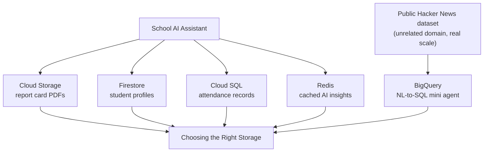

# Module 13 – Storage for AI Applications

**Duration:** 3 hrs
**Goal:** Five different storage services, five different jobs. By the end, you'll know exactly which one to reach for based on the *shape* of your data — not habit, not whichever one you used last.

## The throughline: a small "School AI Assistant"

Four of the five storage topics build small pieces of the same imaginary app — a school portal with an AI assistant — each demonstrating why that specific storage fits that specific piece. BigQuery deliberately breaks from the domain: a single school's data would never be "big data," so it needs a real public dataset to make its point. Topic 6 ties everything back together, including a note on when BigQuery *would* enter this school's picture at real scale.

## Topics (in teaching order)

| # | Topic | Small use case | One-line focus |
|---|-------|------------------|------------------|
| 1 | [Cloud Storage](01-cloud-storage.md) | Student Documents Vault | Object storage — files, not records |
| 2 | [Firestore](02-firestore.md) | Student Profiles | Flexible, nested documents |
| 3 | [Cloud SQL](03-cloud-sql.md) | Student Attendance | True relational data — joins, integrity |
| 4 | [Memorystore (Redis)](04-redis.md) | Cached AI Insights | Caching expensive LLM calls |
| 5 | [BigQuery](05-bigquery.md) | Ask Hacker News (mini agent) | Analytics over genuinely huge data |
| 6 | [Choosing the Right Storage](06-choosing-the-right-storage.md) | Synthesis | The decision framework, applied to everything above |

## Why this module revisits Firestore, Cloud SQL, and Redis

Module 9 (Memory Systems) already used all three — but specifically for agent *memory*. This module teaches the same services from their general-purpose storage role, with fresh use cases (per the course's isolation rule, none of this module's code imports from Module 9's). Cloud Storage and BigQuery are genuinely new — Cloud Storage was only used in passing back in Module 10, and BigQuery hasn't appeared at all yet.

## Format: small Jupyter notebooks, one per topic

Same format as Module 7 — focused, runnable notebooks rather than a large package. Two topics (Cloud SQL, Redis) still need real infrastructure provisioned via `.bat` scripts first, same pattern as Module 9.

## Cost discipline — same rules as Module 9, plus one new one

- **Cloud Storage, Firestore**: free at this scale (Firestore's Always Free tier covers it; Cloud Storage costs pennies for a few KB of files).
- **Cloud SQL, Redis**: no free tier — provision, demo, **tear down immediately** (`99_cleanup.bat`).
- **BigQuery**: 1 TiB of query processing free every month, and public dataset storage costs nothing at all — but `LIMIT` does **not** reduce how much data gets scanned (a genuinely common BigQuery mistake). Topic 5 teaches checking bytes-to-be-scanned before running a query, not just after.

## How the pieces connect

## Prerequisites before starting

- Modules 2, 3, and 9 complete (this module assumes you're comfortable with the Cloud SQL Connector and Redis-via-bastion-tunnel patterns from Module 9 — they're reused quickly here, not re-explained from scratch)
- `.env` filled in (see `code/13-storage-for-ai-applications/.env.example`)

## What you'll be able to do after this module

Given a new AI application feature, correctly match it to the right storage service on the first try — and explain in one sentence why the other four wouldn't fit as well.
