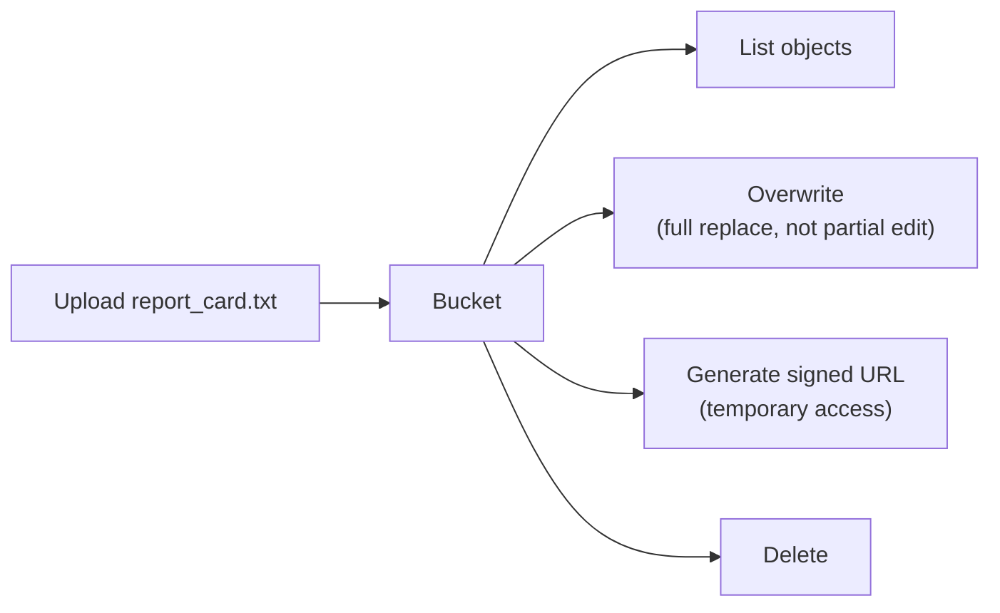

# 1. Cloud Storage

## What Is It? (Plain English)

Cloud Storage holds whole files — documents, images, PDFs, model checkpoints — the way a filing cabinet holds folders, not the way a spreadsheet holds rows. You don't query *inside* a file; you upload it, fetch it, replace it, or delete it, as a whole unit.

## Why It Matters for AI Engineers

Every AI application generates or consumes files that don't belong in a database: uploaded documents (Module 10's RAG corpus lived here), generated images, exported reports, model artifacts. Knowing when something is "a file" versus "a record" is the first fork in this module's decision tree.

## Key Concepts

| Term | Meaning |
|------|---------|
| **Bucket** | A named container for objects — the top-level organizing unit |
| **Object** | One stored file, identified by a key (path-like name) inside a bucket |
| **Storage Class** | Standard / Nearline / Coldline / Archive — same durability, different cost based on how often you access it |
| **Signed URL** | A temporary, permission-scoped link letting someone download/upload without their own GCP credentials |
| **No Partial Update** | Updating an object always replaces it whole — there's no "edit one field" |

## How It Fits Together



## Hands-On

See `code/13-storage-for-ai-applications/01_cloud_storage.ipynb` — the **Student Documents Vault**: upload, list, overwrite, generate a signed URL, delete.

```python
from google.cloud import storage

client = storage.Client(project=PROJECT_ID)
bucket = client.bucket(GCS_BUCKET_NAME)

# Create
bucket.blob("students/alex_report_card.txt").upload_from_string("Grade: A, Attendance: 95%")

# Read
print(bucket.blob("students/alex_report_card.txt").download_as_text())

# Update — a full overwrite, not a partial edit
bucket.blob("students/alex_report_card.txt").upload_from_string("Grade: A+, Attendance: 97%")

# Delete
bucket.blob("students/alex_report_card.txt").delete()
```

## Common Pitfalls

- Expecting to update one field of a stored file the way you'd update a database row — that's not what object storage does; reach for Firestore/Cloud SQL for anything you need to query or partially edit.
- Choosing storage classes randomly — pick based on real access frequency (Standard for frequently accessed, Coldline/Archive for rarely accessed backups), since retrieval from colder classes costs more per access.
- Making a bucket public "just to test" a signed URL — signed URLs exist precisely so you never need to make anything public.

## Quick Recap

1. What's the difference between "a file" and "a record," in terms of which GCP storage service fits?
2. What happens when you "update" an object in Cloud Storage?
3. What's a signed URL for, and why is it safer than making an object public?
