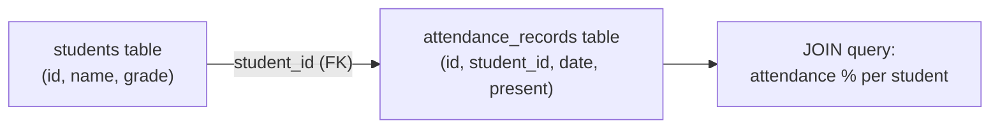

# 3. Cloud SQL

## What Is It? (Plain English)

Cloud SQL is a real relational database — tables, rows, foreign keys, and `JOIN`s. It's the right tool the moment your data has genuine relationships you need to query across, not just store.

## Why It Matters for AI Engineers

Attendance is a perfect example of data that's structurally relational: many attendance records belong to one student, and you constantly want to ask questions *across* that relationship ("what's this student's attendance rate," "who was absent on this date"). That's a `JOIN`, and it's exactly what Firestore struggles to do cleanly.

## Key Concepts

| Term | Meaning |
|------|---------|
| **Foreign Key** | A column in one table referencing another table's primary key — the mechanism that enforces "this attendance record belongs to a real student" |
| **`JOIN`** | Combining rows from two tables based on a related column |
| **Referential Integrity** | The database-enforced guarantee that a foreign key always points to something real |
| **Cloud SQL Python Connector** | The secure connection library from Module 9 — no bastion VM needed, unlike Redis |

## How It Fits Together



## Hands-On

**Provisioning** (start early — 5-10 min, see `code/13-storage-for-ai-applications/03a_provision_cloud_sql.bat`).

See `code/13-storage-for-ai-applications/03_cloud_sql.ipynb` for the full version.

```python
import sqlalchemy
from google.cloud.sql.connector import Connector

connector = Connector()

def getconn():
    return connector.connect(
        f"{PROJECT_ID}:{REGION}:{CLOUD_SQL_INSTANCE_NAME}",
        "pg8000", user=CLOUD_SQL_USER, password=CLOUD_SQL_PASSWORD, db=CLOUD_SQL_DB_NAME,
    )

engine = sqlalchemy.create_engine("postgresql+pg8000://", creator=getconn)

with engine.connect() as conn:
    conn.execute(sqlalchemy.text("""
        CREATE TABLE IF NOT EXISTS students (id SERIAL PRIMARY KEY, name TEXT, grade INT)
    """))
    conn.execute(sqlalchemy.text("""
        CREATE TABLE IF NOT EXISTS attendance_records (
            id SERIAL PRIMARY KEY,
            student_id INT REFERENCES students(id),
            date DATE,
            present BOOLEAN
        )
    """))
    conn.commit()

# ...insert sample rows, then:
result = conn.execute(sqlalchemy.text("""
    SELECT s.name, COUNT(*) FILTER (WHERE a.present) * 100.0 / COUNT(*) AS attendance_pct
    FROM students s JOIN attendance_records a ON s.id = a.student_id
    GROUP BY s.name
"""))
```

## Common Pitfalls

- Trying to compute a cross-student aggregate (like "average attendance across the whole class") against Firestore — this is precisely the query shape relational databases exist for.
- Forgetting the foreign key constraint — without `REFERENCES students(id)`, nothing stops an attendance record from pointing at a student that doesn't exist.
- Leaving the Cloud SQL instance running after the demo — no free tier, same rule as Module 9.

## Quick Recap

1. What does a foreign key actually enforce?
2. Why is attendance data a natural fit for a relational database instead of Firestore?
3. What connection method does this topic reuse from Module 9, and why doesn't Cloud SQL need a bastion VM the way Redis does?
