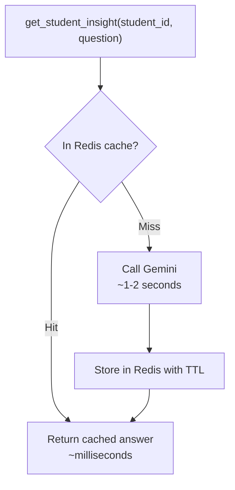

# 4. Memorystore (Redis)

## What Is It? (Plain English)

Redis stores data in memory for extremely fast reads and writes. In Module 9 you used it for session memory; here, the use case is different: **caching an expensive LLM call** so the same question doesn't cost time and money twice.

## Why It Matters for AI Engineers

Every LLM call has real latency and real cost. If your app might get asked the same (or a very similar) question repeatedly — "explain this student's grade trend" is a good example — caching the answer for a while is a genuine production optimization, not a nice-to-have.

## Key Concepts

| Term | Meaning |
|------|---------|
| **Cache Key** | A unique identifier for a specific question/context, used to look up a stored answer |
| **Cache Hit** | The answer was already in Redis — instant, no LLM call needed |
| **Cache Miss** | Not in Redis yet — call the LLM, then store the result before returning it |
| **TTL** | How long a cached answer stays valid before it expires — the control for freshness vs. savings |

## How It Fits Together



## Hands-On — same bastion + tunnel setup as Module 9

Provisioning: `04a_provision_redis_and_bastion.bat`, then the SSH tunnel in a second window (see the `.bat` script's printed instructions — same pattern as Module 9, not re-explained here).

See `code/13-storage-for-ai-applications/04_redis.ipynb` for the full version.

```python
import redis, time, hashlib

r = redis.Redis(host="localhost", port=6379, decode_responses=True)

def get_student_insight(student_id: str, question: str) -> str:
    cache_key = f"insight:{student_id}:{hashlib.md5(question.encode()).hexdigest()}"

    cached = r.get(cache_key)
    if cached:
        return f"[CACHE HIT] {cached}"

    response = genai_client.models.generate_content(model=MODEL_FLASH, contents=question)
    r.setex(cache_key, 3600, response.text)  # cache for 1 hour
    return f"[CACHE MISS] {response.text}"

# Run the same question twice — watch the timing difference
start = time.time(); print(get_student_insight("alex", "Summarize a typical grade trend for a B+ student.")); print(time.time() - start)
start = time.time(); print(get_student_insight("alex", "Summarize a typical grade trend for a B+ student.")); print(time.time() - start)
```

## Common Pitfalls

- Caching forever (no TTL) — stale answers never expire; always set a deliberate expiration.
- Using the raw question text as the cache key without normalizing it — "How many..." and "how many..." would miss each other as different keys.
- Forgetting the SSH tunnel from the provisioning step needs to stay open in its own window while this notebook runs.
- Leaving Redis (and the bastion VM) running after the demo — no free tier, same as Module 9.

## Quick Recap

1. What's the difference between a cache hit and a cache miss, in terms of what actually happens?
2. What does TTL control, and why does it matter?
3. Why does this topic still need the bastion VM + SSH tunnel from Module 9?
