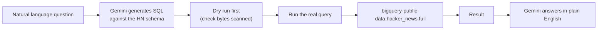

# 5. BigQuery

## What Is It? (Plain English)

BigQuery is a data warehouse built to run SQL queries over genuinely huge datasets — billions of rows — in seconds. Unlike everything else in this module, it's not for your app's live data; it's for *analyzing* large amounts of it.

## Why It Matters for AI Engineers

Once an AI application has been running for a while, you'll have logs, usage data, and historical records at a scale where Cloud SQL starts to strain. BigQuery is where that data goes to actually be analyzed — and, increasingly, where an *agent* itself can go to answer questions about your data in natural language.

## Key Concepts

| Term | Meaning |
|------|---------|
| **Public Dataset** | A dataset Google hosts and pays the storage cost for — you only pay to query it |
| **Bytes Scanned** | What BigQuery actually charges for — not rows returned |
| **`LIMIT` does NOT reduce bytes scanned** | A `LIMIT 10` still scans every row of the columns you selected — it only limits what's *displayed* |
| **Dry Run** | A query mode that estimates bytes-to-be-scanned *before* you actually run (and pay for) the query |
| **Free Tier** | 1 TiB of query processing free every month — confirmed against Google's current pricing |

## How It Fits Together



## The pricing lesson, before any code

```python
# ALWAYS check this before running a query against a public dataset
job_config = bigquery.QueryJobConfig(dry_run=True, use_query_cache=False)
dry_run_job = client.query(sql, job_config=job_config)
print(f"This query will scan {dry_run_job.total_bytes_processed / 1e9:.2f} GB")
```
`LIMIT 10` at the end of a query does not change this number — the engine still reads every row of every column you `SELECT`ed before trimming the display. Selecting fewer, narrower columns is what actually reduces cost.

## Hands-On — the mini agent

See `code/13-storage-for-ai-applications/05_bigquery.ipynb` — **Ask Hacker News**: a single-tool agent using the same function-calling pattern from Module 3, not a framework.

```python
def run_bigquery_sql(sql: str) -> str:
    """Execute a BigQuery Standard SQL query and return the results."""
    query_job = client.query(sql)
    rows = list(query_job.result())
    return str(rows)

# Gemini is given the HN table schema in its system prompt, generates SQL,
# the tool executes it, the result comes back for a natural-language answer.
```

## Common Pitfalls

- Assuming public datasets cost money to store — Google pays for that; you only pay for querying, and even that's free up to 1 TiB/month.
- Running `SELECT *` on a huge public table "just to look" — this can scan far more data (and far more of your free tier) than intended; always select specific columns.
- Letting an LLM-generated SQL query run without a sanity check — for this small demo it's fine, but in anything production-shaped, dry-run and validate LLM-generated SQL before executing it against real data.

## Quick Recap

1. What does BigQuery actually charge for — rows returned, or something else?
2. Does `LIMIT 10` reduce your query's cost? Why or why not?
3. Why does the mini agent in this topic use plain function calling instead of a framework?
