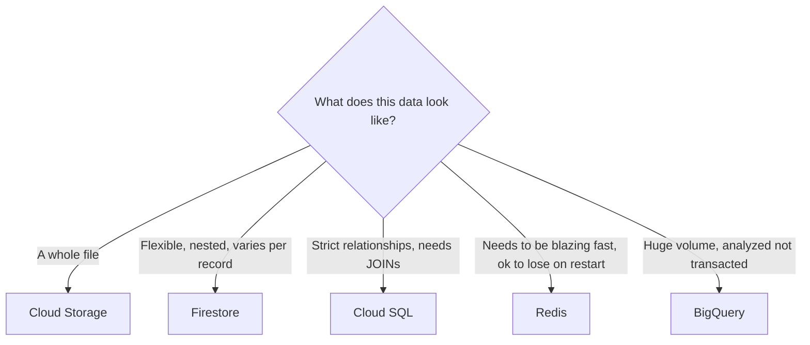

# 6. Choosing the Right Storage

## What Is It? (Plain English)

This topic is the payoff for the whole module: a decision framework for picking the right storage service based on the *shape* and *access pattern* of your data — not habit, not whichever one you already have open.

## Why It Matters for AI Engineers

Picking the wrong storage isn't just inefficient — it's the kind of decision that's expensive to unwind later, once an application has grown around it. Getting this right early is a real architectural skill.

## The Comparison

| | Cloud Storage | Firestore | Cloud SQL | Redis | BigQuery |
|---|---|---|---|---|---|
| **Data shape** | Whole files | Flexible documents | Strict relational rows | Key-value, in-memory | Huge analytical tables |
| **Query style** | None — fetch by name | Simple filters | Full SQL, `JOIN`s | Key lookup | Full SQL, analytical |
| **Speed** | Good | Good | Good | Extremely fast | Slow per-query, but scans huge data |
| **This module's example** | Report card PDFs | Student profiles | Attendance records | Cached AI insights | Public HN dataset |
| **Free tier?** | Yes, small scale | Yes (Always Free) | No | No | Yes, 1 TiB/month |

## How It Fits Together

## Hands-On — for our School AI Assistant

| Feature | Storage chosen | Why |
|---|---|---|
| Report card PDFs | Cloud Storage | Whole files, not queried internally |
| Student profiles | Firestore | Flexible fields per student |
| Attendance | Cloud SQL | Needs `JOIN`s and aggregation across students |
| "Explain this trend" AI answers | Redis | Needs to be instant on repeat asks |
| Years of historical records, analyzed at scale | BigQuery | *Not built yet* — this is where the school's data would go once it's been accumulating for years across many students and many years |

## Scenario Check — answer before scrolling

1. A photo-sharing feature where users upload profile pictures. Where does it go?
2. A leaderboard that needs to update instantly as scores come in, but doesn't need to survive a server restart. Where does it go?
3. Ten years of attendance data across 50 schools, and the district wants "average attendance trend by year." Where does it go?

*(Answers: 1. Cloud Storage — whole files. 2. Redis — speed matters more than durability here. 3. BigQuery — exactly the volume + analytical shape it's built for.)*

## Common Pitfalls

- Treating this as a one-time lesson instead of a framework you re-apply on every new feature.
- Defaulting to "whatever we're already using" instead of asking what the data actually looks like.
- Forgetting that these aren't mutually exclusive — most real apps, like this module's own School AI Assistant, use several storage types together.

## Quick Recap

1. What's the first question to ask when choosing a storage service for a new feature?
2. Name one feature from this module's School AI Assistant and the storage it uses.
3. At what point would this school's own data actually justify BigQuery?
