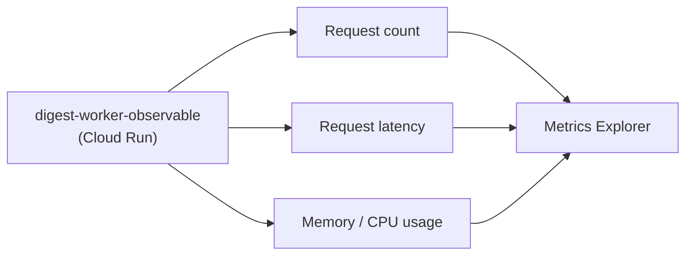

# 2. Cloud Monitoring

## What Is It? (Plain English)

Cloud Monitoring is where GCP automatically shows you how a deployed service is behaving — how many requests it's getting, how long they take, how much memory it's using — without you writing a single line of extra code.

## Why It Matters for AI Engineers

Before you ever define a custom metric (topic 5), Cloud Monitoring already gives you the basics for free the moment something is deployed on Cloud Run. This topic is about knowing what's already there before reaching for anything custom.

## Key Concepts

| Term | Meaning |
|------|---------|
| **Built-in Metric** | Something GCP collects automatically for supported resource types — no code needed |
| **Resource Type** | What's being measured — `cloud_run_revision`, in this module's case |
| **Time Series** | A metric's values over time — what every graph in Monitoring is actually showing |
| **Metrics Explorer** | The Console tool for browsing and charting any metric, built-in or custom |

## How It Fits Together



## Step-by-Step

**1. Generate some traffic** (a few normal calls, if you haven't already):
```bat
curl %SERVICE_URL%
curl %SERVICE_URL%
curl %SERVICE_URL%
```

**2. Open Metrics Explorer:** Console → **Monitoring → Metrics Explorer** → select resource type `Cloud Run Revision`, metric `Request Count` (or `Request Latencies`).

**3. From the CLI, list what's available:**
```bat
gcloud monitoring metrics-descriptors list --filter="metric.type:run.googleapis.com" --limit=10
```

## Common Pitfalls

- Assuming you need to set anything up for these — built-in metrics for supported resources (Cloud Run, Cloud Functions, etc.) are automatic.
- Confusing this topic with topic 5 — this is what GCP gives you; topic 5 is what you define yourself.
- Looking for data before any traffic has happened — an idle service with zero requests has nothing to graph yet.

## Quick Recap

1. What has to happen before Cloud Monitoring shows anything for this service?
2. Name two built-in metrics available for a Cloud Run service with zero extra code.
3. What's the difference between this topic and topic 5?
