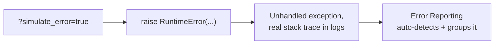

# 3. Error Reporting

## What Is It? (Plain English)

Error Reporting automatically scans your logs for stack traces, groups matching errors together, and shows you exactly how often each one is happening — without you configuring anything specific to catch it.

## Why It Matters for AI Engineers

An error that happens once, buried in thousands of log lines, is easy to miss. Error Reporting surfaces "this exact failure has happened 12 times in the last hour" automatically — genuinely useful the moment real users start hitting a real bug.

## Key Concepts

| Term | Meaning |
|------|---------|
| **Unhandled Exception** | A real Python exception that isn't caught — exactly what this topic's `simulate_error` switch produces |
| **Grouping** | Error Reporting clusters similar stack traces together as one "error," not one entry per occurrence |
| **Automatic Detection** | For supported runtimes (Cloud Run included), no manual reporting call is needed for unhandled exceptions |

## How It Fits Together



## Step-by-Step

**1. Trigger the simulated error:**
```bat
curl "%SERVICE_URL%/?simulate_error=true"
```
You'll get a 500 response — that's expected, this is a real crash, on purpose.

**2. Wait a few seconds, then check Error Reporting:** Console → **Error Reporting**. You should see a new grouped error with the real Python stack trace, occurrence count, and first/last seen timestamps.

**3. From the CLI:**
```bat
gcloud logging read "resource.type=cloud_run_revision AND severity=ERROR" --limit=10
```

## Common Pitfalls

- Wrapping every possible error in a broad `try/except` that swallows exceptions silently — that would actually *hide* problems from Error Reporting, not fix them; only catch what you can meaningfully handle.
- Expecting the error to appear instantly — same short ingestion delay as Cloud Logging.
- Confusing an *expected* error response (like a validated "no headlines found" case, handled with a normal 200/400 response) with an actual unhandled exception — only the latter shows up here.

## Quick Recap

1. What makes this topic's simulated error show up in Error Reporting automatically?
2. What does "grouping" mean, and why is it useful?
3. Why would silently catching every exception be a bad idea from an observability standpoint?
