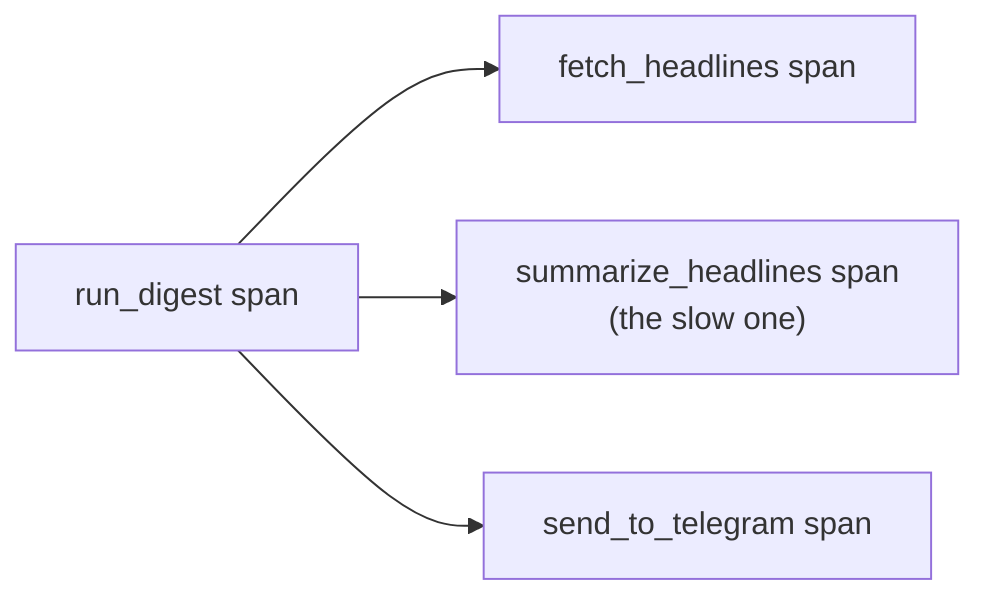

# 4. Cloud Trace

## What Is It? (Plain English)

Cloud Trace shows you a timeline — a "waterfall" — of exactly how long each step inside a single request took. Not "the request took 8 seconds" but "the request took 8 seconds, and 7.9 of them were the Gemini call."

## Why It Matters for AI Engineers

An AI pipeline has several genuinely different steps — fetch, summarize, send — and they don't cost the same. Guessing which one is slow is a waste of time when Trace can just show you.

## Key Concepts

| Term | Meaning |
|------|---------|
| **Span** | One measured step inside a request — `fetch_headlines`, `summarize_headlines`, `send_to_telegram` in this module's code |
| **Trace** | The full collection of spans for one request, shown as a waterfall |
| **Attribute** | Extra data attached to a span (e.g., `feed_url`, `headline_count`) — same idea as Logging's structured fields, but on a span |
| **OpenTelemetry** | The open standard library used to create spans, exported to Cloud Trace |

## How It Fits Together



## Step-by-Step

**1. Trigger the simulated slowness:**
```bat
curl "%SERVICE_URL%/?simulate_slow=true"
```

**2. Open Cloud Trace:** Console → **Trace → Trace List**, find the recent trace, open it. The `summarize_headlines` span should visibly dominate the timeline.

**3. Compare against a normal request:**
```bat
curl %SERVICE_URL%
```
Open its trace too — same shape, much shorter `summarize_headlines` span.

## Common Pitfalls

- Only wrapping the whole request in one span — that tells you "it was slow," not "here's *what* was slow." Break work into meaningful sub-spans, like this module's code does.
- Expecting traces instantly — same short ingestion delay as Logging and Error Reporting.
- Forgetting to set meaningful attributes on spans — an unlabeled span is much harder to reason about later than one tagged with `feed_url` or `headline_count`.

## Quick Recap

1. What's the difference between a trace and a span?
2. Which span should dominate the waterfall when `simulate_slow=true` is used, and why?
3. Why break a request into multiple spans instead of one big one?
