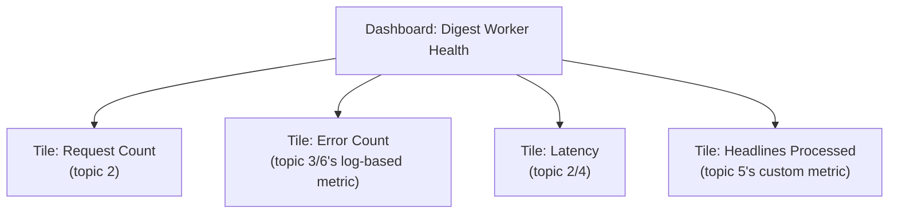

# 7. Dashboards

## What Is It? (Plain English)

A dashboard puts several metrics on one screen — request count, errors, latency, your custom metric — so you can see the health of a service at a glance, instead of switching between five separate console pages.

## Why It Matters for AI Engineers

This is what you'd actually leave open during an on-call shift or a launch. Every earlier topic in this module produced one signal; a dashboard is where they all come together into something genuinely useful to look at.

## Key Concepts

| Term | Meaning |
|------|---------|
| **Dashboard** | A named collection of chart "tiles," each showing one or more metrics |
| **Tile** | One chart on the dashboard — this module's has four: requests, errors, latency, custom metric |
| **`--config-from-file`** | How you deploy a dashboard definition from a JSON file, same pattern as topic 6's alert policy |

## How It Fits Together



## Step-by-Step

**1. Look at `07_dashboard.json`** — four tiles, one per signal built up across this module.

**2. Deploy it:**
```bat
gcloud monitoring dashboards create --config-from-file=07_dashboard.json
```

**3. View it:** Console → **Monitoring → Dashboards** → open "Digest Worker Health."

**4. Generate a mix of traffic to make it interesting:**
```bat
curl %SERVICE_URL%
curl "%SERVICE_URL%/?simulate_error=true"
curl "%SERVICE_URL%/?simulate_slow=true"
```
Refresh the dashboard after a minute — every tile should show real, current data.

## Common Pitfalls

- Building a dashboard with dozens of tiles "to be thorough" — a dashboard nobody can read at a glance isn't useful; four focused tiles beats fifteen scattered ones.
- Forgetting a dashboard is just a saved view — it doesn't create any new data, it only visualizes what topics 1-5 already produced.
- Not connecting each tile back to why it's there — a good dashboard tells a story (is it working? is it slow? is it erroring?), not just "here are some numbers."

## Quick Recap

1. What are the four tiles on this module's dashboard, and which topic did each one's data come from?
2. Does creating a dashboard generate any new monitoring data?
3. Why is a small, focused dashboard usually better than an exhaustive one?
