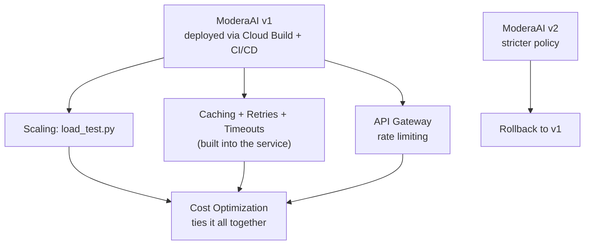

# Module 17 – Production AI Engineering

**Duration:** 4 hrs
**Goal:** You've deployed things, triggered them, and watched them run. This module is the last mile: taking one small AI service and making it trustworthy enough for real, unpredictable internet traffic.

## The use case: ModeraAI — a content moderation bouncer

Think of it like hiring a bouncer for a comments section. Any site that accepts user text — a blog, a forum, a chat app — needs to check whether a piece of text is okay before it goes live. ModeraAI is that bouncer, built as one tiny standalone API with a single job:

```
POST /moderate
{"text": "I hate you, you're so stupid and ugly"}

-> {"flagged": true, "category": "harassment", "reasoning": "Insulting, demeaning language directed at a person."}
```
```
POST /moderate
{"text": "Great article, thanks for sharing!"}

-> {"flagged": false, "category": "safe", "reasoning": "Friendly, on-topic feedback."}
```

That's the entire product — one URL, send text, get a verdict, powered by one Gemini call underneath. **The point of this module isn't the bouncer itself — it's everything you'd have to do before trusting that bouncer with a real crowd.** Every topic below takes this same tiny service and hardens it against one specific real-world failure mode.

## Topics, and — critically — how each one is actually tested

| # | Topic | What we harden | How we test it |
|---|-------|-------------------|------------------|
| 1 | [Scaling](01-scaling.md) | Handling a burst of traffic | `load_test.py` fires 50 concurrent requests; watch Cloud Run's instance count graph live |
| 2 | [Cloud Build](02-cloud-build.md) | Building the container reliably | `gcloud builds submit` run manually, then inspect the build log |
| 3 | [CI/CD](03-ci-cd.md) | Deploying automatically | Push a real commit to GitHub, watch a build+deploy happen with zero manual commands |
| 4 | [Versioning](04-versioning.md) | Knowing exactly what's live | Deploy `v2.0.0` alongside `v1.0.0`, call both by their distinct URLs/revisions |
| 5 | [Rollbacks](05-rollbacks.md) | Undoing a bad deploy | Prove v2 over-flags safe text, then roll live traffic back to v1 in one command |
| 6 | [Caching](06-caching.md) | Not re-paying for the same question | Call the same text twice, compare response time and `cache_hit` field |
| 7 | [Retry Strategies](07-retry-strategies.md) | Surviving a transient hiccup | A `?simulate_transient_failure=true` switch fails twice then succeeds — watch the retry log it |
| 8 | [Timeouts](08-timeouts.md) | Never hanging forever | A `?simulate_hang=true` switch deliberately stalls — watch the timeout cut it off |
| 9 | [Rate Limiting](09-rate-limiting.md) | Surviving abuse | Fire requests past API Gateway's quota, watch a real 429 come back |
| 10 | [Cost Optimization](10-cost-optimization.md) | Not a surprise bill | Compare Flash vs. Pro cost, then prove caching cuts real Gemini calls with a request counter |

Every single topic in this module ends the same way: **break the thing on purpose, on your own terms, and watch the safeguard catch it** — the same discipline from Module 16, now applied to production resilience instead of monitoring.

## A quick note on topic 9

Rather than hand-building rate-limiting logic, this topic reuses **API Gateway's own built-in quota feature** (Module 15) — configured declaratively in the OpenAPI spec, not custom code. That's not a simplification for teaching purposes; it's the more realistic choice — real teams reach for the platform's built-in tool before writing custom rate-limiting code.

## How the pieces connect



## Prerequisites before starting

- Modules 14, 15, and 16 complete
- A GitHub account with this course's repo (or your own fork) — needed for topic 3's CI/CD trigger
- `.env` filled in (see `code/17-production-ai-engineering/.env.example`)

## What you'll be able to do after this module

Take any small, working AI service and systematically prove it can survive real traffic, real failures, real cost pressure, and real mistakes — the actual difference between a demo and something you'd trust with real users.
