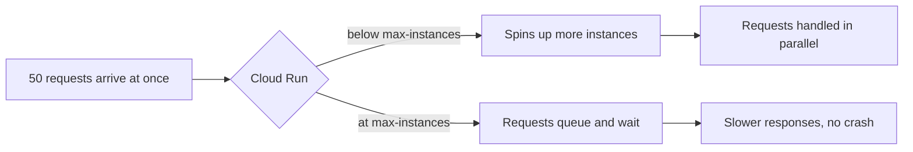

# 1. Scaling

## What Is It?

Imagine a single cashier at a shop. One customer at a time, no problem. Now fifty customers walk in at once — one cashier can't serve them all, so a line forms and people wait. Scaling is opening more checkout counters automatically when the crowd shows up, and closing them again once the crowd leaves.

Cloud Run does exactly this for ModeraAI: when requests pile up, it starts new copies (instances) of the service to handle them, all on its own. You don't provision servers — you just tell it the rules: how many instances at most, how many requests each one can juggle at once.

## Why It Matters for AI Engineers

AI calls are slow compared to a normal API — a Gemini call can take a second or more. If ten people hit ModeraAI in the same second and it can only truly process one at a time, nine of them sit waiting. Scaling is what turns "works in my demo" into "works when real traffic shows up," and it's the very first thing that breaks in an unprepared AI service, because AI calls are exactly the slow, expensive kind of work that queues up fastest.

## Key Concepts

| Term | Definition |
|---|---|
| Instance | One running copy of your container, able to handle requests |
| Concurrency | How many requests one instance will accept at the same time (Cloud Run default: 80) |
| `--max-instances` | The hard ceiling — Cloud Run will never start more instances than this |
| `--min-instances` | Instances kept warm even with zero traffic (avoids cold starts, costs money at rest) |
| Cold start | The delay when Cloud Run has to start a brand-new instance from nothing |
| Autoscaling | Cloud Run's automatic decision of how many instances to run right now, based on load |

## How It Fits Together



## Hands-On

**Console:** Cloud Run → `moderaai` service → **Metrics** tab → watch "Instance count" and "Request latency" graphs.

**CLI/SDK:**

```bat
REM Deploy with a generous ceiling
gcloud run deploy moderaai --source . --region %REGION% --allow-unauthenticated --max-instances=10

REM Fire the load test — 50 concurrent requests
python scripts/load_test.py
```

## How We Test It

This is the topic where "trust me, it scales" isn't good enough — we prove it two ways:

1. **`scripts/load_test.py`** uses Python's `ThreadPoolExecutor` to fire 50 `/moderate` requests at ModeraAI at the same time (not one after another) and prints each request's status code and response time. While it runs, watch the Cloud Run **Metrics** tab — the instance count graph climbs in real time as Cloud Run spins up new copies to absorb the burst.
2. **The ceiling test:** redeploy with `--max-instances=2`, run `scripts/load_test.py` again. Same 50 requests, but now only 2 instances exist — the printed response times are visibly slower, and the metrics graph flatlines at 2 instances instead of climbing. This proves the ceiling is real, not just a config value that gets ignored.

## Common Pitfalls

- Assuming autoscaling is unlimited — it always has a ceiling, whether you set one or Cloud Run's project-level default does
- Setting `--min-instances=0` everywhere and being surprised by cold-start latency on the very first request after idle time
- Forgetting that concurrency (requests per instance) and instance count (number of instances) are two separate dials — both affect how much traffic you can absorb

## Quick Recap

1. What happens to the 51st request if `--max-instances` is already reached?
2. Why does an AI service tend to hit scaling limits faster than a typical CRUD API?
3. What's the difference between `--min-instances` and `--max-instances`?
