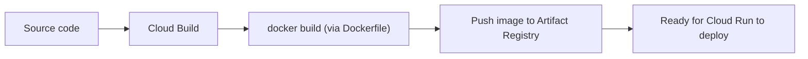

# 2. Cloud Build

## What Is It?

Up to now, when you deployed a service, your own laptop did the work of building the Docker container before shipping it off. Cloud Build is a factory in the cloud that does that building step for you — it takes your source code, builds the container image, and stores it, all on Google's machines, not yours.

## Why It Matters for AI Engineers

Once a team is bigger than one person, "build it on my laptop" stops being reliable — different machines, different installed versions, someone's laptop is asleep. Cloud Build gives everyone the exact same, repeatable build environment, and it's also the engine that makes CI/CD (the next topic) possible — you can't auto-deploy on every push if there's no automatic way to build first.

## Key Concepts

| Term | Definition |
|---|---|
| Build | The process of turning your Dockerfile + source into a runnable container image |
| `cloudbuild.yaml` | A file describing the build steps, in order |
| Build log | Streamed, timestamped output of everything the build did |
| Artifact Registry | Where the finished image gets stored after the build (from Module 14) |

## How It Fits Together



## Hands-On

**Console:** Cloud Build → **History** — after running a build, click into it to see the same log live.

**CLI/SDK** (`02_cloud_build_manual.bat`, run from `code/17-production-ai-engineering/`):

```bat
REM Manual, one-off remote build (no local Docker needed).
REM Submitted from the REPO ROOT (the script pushd's there first) so the
REM build source matches exactly what topic 3's CI/CD trigger will later
REM submit automatically - a real GitHub push checks out the whole repo,
REM never just this module's subfolder.
pushd ..\..
gcloud builds submit --config=code/17-production-ai-engineering/moderaai/cloudbuild.yaml --substitutions=_REGION=%REGION%,_TAG=v1.0.0 .
popd
```

`cloudbuild.yaml` (in `code/17-production-ai-engineering/moderaai/`):

```yaml
steps:
  - name: 'gcr.io/cloud-builders/docker'
    dir: 'code/17-production-ai-engineering/moderaai'
    args: ['build', '-t', '${_REGION}-docker.pkg.dev/${PROJECT_ID}/moderaai-repo/moderaai:${_TAG}', '.']
  - name: 'gcr.io/cloud-builders/docker'
    args: ['push', '${_REGION}-docker.pkg.dev/${PROJECT_ID}/moderaai-repo/moderaai:${_TAG}']
  - name: 'gcr.io/google.com/cloudsdktool/cloud-sdk'
    entrypoint: gcloud
    args:
      - run
      - deploy
      - moderaai
      - '--image=${_REGION}-docker.pkg.dev/${PROJECT_ID}/moderaai-repo/moderaai:${_TAG}'
      - '--region=${_REGION}'
      - '--allow-unauthenticated'
substitutions:
  _REGION: us-central1
  _TAG: latest
images:
  - '${_REGION}-docker.pkg.dev/${PROJECT_ID}/moderaai-repo/moderaai:${_TAG}'
```

The `dir:` on the build step matters more than it looks — without it, the docker build step would use whatever the *build's source root* happens to be as its context. That's harmless when you happen to submit from inside `moderaai/` itself, but it silently breaks the moment the same file is triggered by a real GitHub push (topic 3), which always checks out the *entire* repo. Pointing `dir:` at this module's exact folder makes the config work identically either way — which is also why the manual command above submits from the repo root instead of `moderaai/`: so the "manual" and "automatic" paths are tested against the literal same conditions.

## How We Test It

Run `02_cloud_build_manual.bat` directly and watch the log stream in the terminal in real time — three visibly distinct steps scroll past (docker build, docker push, gcloud run deploy). Then open Cloud Build → History in the Console and click into that same build to show students it's a permanent, auditable record, not just terminal output that vanishes.

## Common Pitfalls

- Forgetting `--region` matches your Artifact Registry repo's region — build succeeds, push fails
- Editing `cloudbuild.yaml` and forgetting substitution variables (`${_REGION}`) need a matching `substitutions:` block or a `--substitutions` flag
- Confusing "build" (make the image) with "deploy" (run the image) — Cloud Build can do both if you tell it to, like the config above does

## Quick Recap

1. What does Cloud Build produce, and where does it store it?
2. Why is a shared, remote build environment more reliable than "build on my laptop"?
3. What are the three steps in this module's `cloudbuild.yaml`?
