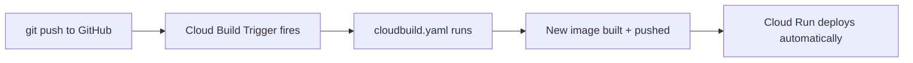

# 3. CI/CD

## What Is It?

CI/CD stands for Continuous Integration / Continuous Deployment. In plain words: instead of you manually running build-and-deploy commands every time you change code, you connect your GitHub repo to Cloud Build once, and from then on, every `git push` automatically triggers a build and a deploy — no human types a `gcloud` command ever again.

## Why It Matters for AI Engineers

AI services change often — a new prompt, a tweaked policy, a new model version. If shipping each change requires someone to remember five manual steps, changes ship slowly and inconsistently, and it's easy to forget a step under pressure. CI/CD makes "push code" and "it's live" the same action, which is what lets a team ship many small, safe changes instead of rare, risky big ones.

## Key Concepts

| Term | Definition |
|---|---|
| CI (Continuous Integration) | Automatically building/testing code on every change |
| CD (Continuous Deployment) | Automatically deploying that build if it succeeds |
| Trigger | The rule connecting "a push happened" to "run this build" |
| GitHub connection | A one-time authorization letting Cloud Build see your repo |

## How It Fits Together



## Hands-On

**Console (one-time setup — do this once, live, and narrate it):**

1. Cloud Build → **Triggers** → **Connect Repository**
2. Choose **GitHub**, authorize the Google Cloud Build GitHub App, select this course's repo
3. **Create Trigger** → Event: Push to a branch → Branch: `^main$` → Configuration: `cloudbuild.yaml` at `code/17-production-ai-engineering/moderaai/cloudbuild.yaml`
4. Save

**CLI (recreating the same trigger by command, for reference):**

```bat
gcloud builds triggers create github ^
  --repo-name=GCP-UDMEY ^
  --repo-owner=%GITHUB_USERNAME% ^
  --branch-pattern="^main$" ^
  --build-config=code/17-production-ai-engineering/moderaai/cloudbuild.yaml ^
  --name=moderaai-deploy-trigger
```

## How We Test It

This is the one topic that must be tested with a **real commit** — no simulation makes sense here. Make a small, visible change (e.g. bump a version string or tweak a log message in `main.py`), then:

```bat
git add .
git commit -m "test: trigger CI/CD"
git push
```

Then immediately switch to Cloud Build → **History** in the Console and watch a new build appear and run on its own within roughly a minute, with zero manual `gcloud` commands typed. Once it finishes, `curl` the live service URL and show the change is already there.

## Common Pitfalls

- Expecting the trigger to fire instantly — there's a real webhook + queueing delay, usually under a minute but not zero
- Pushing to a branch that doesn't match the trigger's branch pattern and wondering why nothing happened
- Forgetting the trigger's `cloudbuild.yaml` path must match the file's actual path in the repo exactly

## Quick Recap

1. What's the difference between CI and CD?
2. What one-time step has to happen before pushes can trigger builds?
3. How do you prove a CI/CD pipeline actually works, rather than just trusting it's configured correctly?
