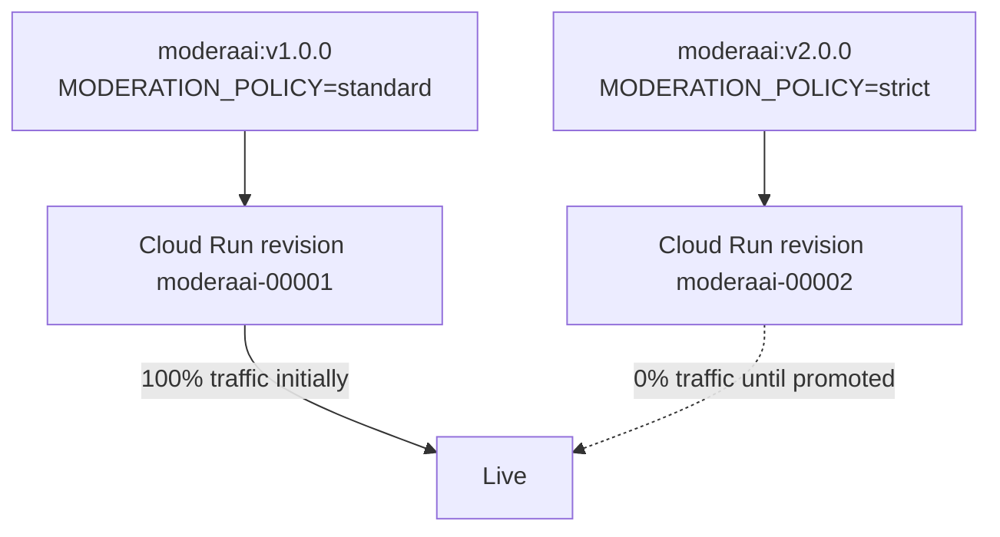

# 4. Versioning

## What Is It?

If you label every batch of cookies "cookies," you can never tell a fresh batch from a stale one. Versioning is putting a clear label — `v1.0.0`, `v2.0.0` — on every build of ModeraAI, both on the container image and on the Cloud Run revision it creates, so at any moment you can say exactly what code is answering requests.

## Why It Matters for AI Engineers

AI services are especially easy to accidentally "silently change" — a tweaked prompt, a swapped model name, a different moderation policy — none of which look like a code change at a glance. Without versioning, "it used to work" is undebuggable, because you can't prove what was actually running when it worked. Versioning is also what makes rollbacks (next topic) possible at all — you can't roll back to something you never labeled.

## Key Concepts

| Term | Definition |
|---|---|
| Image tag | The version label on the container image itself (`moderaai:v2.0.0`) |
| Cloud Run revision | An immutable, addressable snapshot Cloud Run creates every time you deploy |
| Traffic split | What percentage of live traffic each revision currently receives |
| Semantic versioning | `MAJOR.MINOR.PATCH` — a convention for what a version bump means |

## How It Fits Together



## Hands-On

```bat
REM Build and tag v2 explicitly — a stricter moderation policy via env var
gcloud builds submit --tag %REGION%-docker.pkg.dev/%PROJECT_ID%/moderaai-repo/moderaai:v2.0.0 moderaai

REM Deploy v2 as a new revision, but keep it at 0% traffic — v1 stays live
gcloud run deploy moderaai ^
  --image=%REGION%-docker.pkg.dev/%PROJECT_ID%/moderaai-repo/moderaai:v2.0.0 ^
  --region=%REGION% ^
  --set-env-vars=MODERATION_POLICY=strict ^
  --no-traffic ^
  --tag=v2

REM List every revision that currently exists
gcloud run revisions list --service=moderaai --region=%REGION%
```

## How We Test It

`gcloud run revisions list` after the deploy above proves two distinct, independently-addressable revisions exist side by side (`moderaai-00001` running v1, `moderaai-00002` running v2), neither one overwriting the other. Then hit v2's revision-specific tagged URL directly (`https://v2---moderaai-<hash>.a.run.app`) and v1's main URL separately, calling `/moderate` on each with the same input — showing they can genuinely return different verdicts because they're genuinely different, independently-running code.

## Common Pitfalls

- Deploying without `--no-traffic` and accidentally sending 100% of live traffic straight to an untested v2
- Reusing the `:latest` tag for a real change — it silently overwrites the previous meaning of "latest" with no record of what changed
- Assuming a new Cloud Run revision replaces the old one — it doesn't; both exist until you explicitly delete one

## Quick Recap

1. What's the difference between an image tag and a Cloud Run revision?
2. Why does `--no-traffic` matter when deploying a new version?
3. Why is `:latest` a bad tag to rely on for anything you'd need to roll back to?
