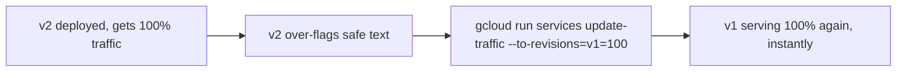

# 5. Rollbacks

## What Is It?

A rollback is hitting undo on a deploy. If the new version turns out to be broken, you don't fix-forward under pressure — you flip live traffic back to the last version you know was good, instantly, because (thanks to versioning) that old revision never went away.

## Why It Matters for AI Engineers

An AI service can fail in ways a normal service can't: not by crashing, but by quietly giving *wrong* answers — over-flagging safe comments, under-flagging bad ones. Nothing throws an error, so nothing pages anyone. Rollbacks are the safety net for exactly this kind of failure: when you notice bad behavior, the fix isn't a hotfix — it's traffic, pointed back at the version that behaved correctly.

## Key Concepts

| Term | Definition |
|---|---|
| `update-traffic` | The command that reassigns what % of traffic goes to which revision |
| Instant rollback | Because the old revision already exists and is already running, rollback has near-zero latency |
| Traffic tag | A stable label (like `v2`) pointing at a specific revision, for testing before promoting |

## How It Fits Together



## Hands-On

```bat
REM Promote v2 to live traffic (simulating "we shipped it")
gcloud run services update-traffic moderaai --region=%REGION% --to-revisions=moderaai-00002=100

REM Prove it's broken: an obviously safe comment gets over-flagged under the strict policy
curl -X POST %SERVICE_URL%/moderate -H "Content-Type: application/json" -d "{\"text\": \"I disagree with this policy.\"}"

REM Roll back instantly — no rebuild, no redeploy, just a traffic change
gcloud run services update-traffic moderaai --region=%REGION% --to-revisions=moderaai-00001=100

REM Same call again — now correctly not flagged
curl -X POST %SERVICE_URL%/moderate -H "Content-Type: application/json" -d "{\"text\": \"I disagree with this policy.\"}"
```

## How We Test It

This topic is tested as a before/after pair, deliberately: call `/moderate` with a mild, clearly-safe disagreement ("I disagree with this policy") while v2's strict policy is live and show it gets incorrectly `flagged: true`. Then run the `update-traffic` rollback command and make the *exact same call again* — now `flagged: false`. The point being demonstrated is that nothing was rebuilt or redeployed between the two calls — only where traffic points changed, and the fix was live in seconds.

## Common Pitfalls

- Treating a rollback as "redeploy the old code" — that's slower and unnecessary; the old revision is still running
- Rolling back and forgetting to also stop whatever pipeline might auto-redeploy the bad version again (CI/CD topic 3) — investigate root cause before re-enabling
- Splitting traffic (e.g. 50/50) to gradually verify a fix, then forgetting to finish the rollback to 100%

## Quick Recap

1. Why is a rollback close to instant, unlike a fresh deploy?
2. What kind of AI failure is rollbacks specifically good at fixing, that a crash-based alert wouldn't catch?
3. What command reassigns traffic between two existing revisions?
