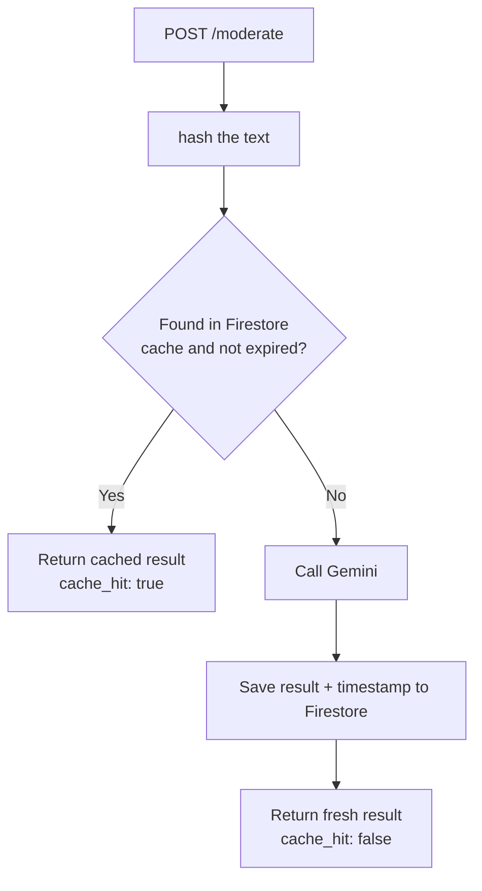

# 6. Caching

## What Is It?

If two different people ask you the exact same question five minutes apart, you don't re-derive the answer from scratch the second time — you just remember what you said. Caching is ModeraAI doing the same thing: if it's already moderated this exact text before, it hands back the saved verdict instead of calling Gemini again.

## Why It Matters for AI Engineers

Every Gemini call costs real money and real time. In a moderation use case, the same text shows up more than once — a popular comment gets copy-pasted, a spam bot sends the same message repeatedly, a user edits and resubmits the same draft. Caching is one of the highest-leverage cost and latency wins available in an AI service, for close to zero added complexity.

## Key Concepts

| Term | Definition |
|---|---|
| `content_hash()` | A SHA-256 hash of the input text — used as a stable cache key |
| Cache hit | The requested text was already moderated; return the saved result |
| Cache miss | New text; call Gemini, then save the result for next time |
| TTL (Time To Live) | How long a cached result stays valid before it's treated as stale (this module: 3600s / 1 hour) |

## How It Fits Together



## Hands-On

```bat
REM First call - cache miss, real Gemini call, slower
curl -X POST %SERVICE_URL%/moderate -H "Content-Type: application/json" -d "{\"text\": \"Great article, thanks for sharing!\"}"

REM Same call again - cache hit, no Gemini call, much faster
curl -X POST %SERVICE_URL%/moderate -H "Content-Type: application/json" -d "{\"text\": \"Great article, thanks for sharing!\"}"
```

## How We Test It

Call `/moderate` with the identical text twice in a row and look at two things in the JSON response: the `cache_hit` field (`false` then `true`) and the wall-clock response time, which is easy to eyeball with `curl -w "\nTime: %{time_total}s\n"` — the first call takes roughly a second or more (a real Gemini round trip), the second is near-instant (a Firestore read only). That timing gap *is* the proof; no logs needed to see it.

## Common Pitfalls

- Hashing the raw text without normalizing (e.g. trimming whitespace/casing) — near-identical inputs miss the cache when they arguably shouldn't
- Caching forever with no TTL — stale results linger even after you improve the moderation prompt
- Forgetting the cache is keyed on exact text — this is a moderation *result* cache, not a semantic similarity cache (that's Module 9 territory)

## Quick Recap

1. What's used as the cache key, and why does it need to be a hash rather than the raw text?
2. What two things prove a cache hit actually happened, without reading server logs?
3. Why does this cache have a TTL instead of lasting forever?
