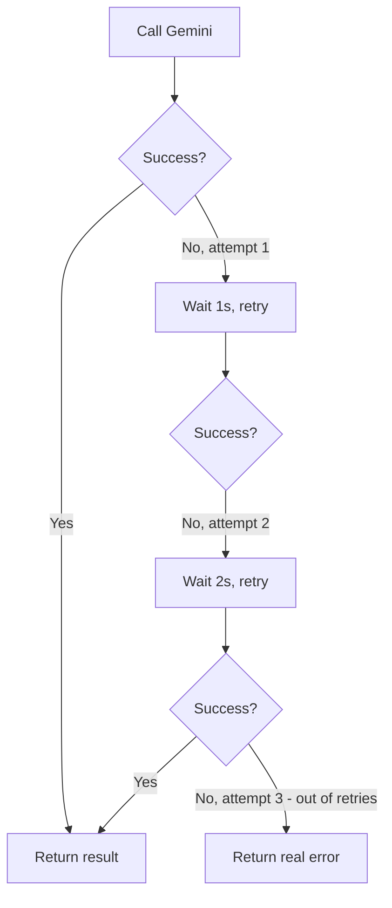

# 7. Retry Strategies

## What Is It?

If you call someone and the line drops, you don't give up forever — you call again. A retry strategy is ModeraAI doing that automatically: if a call to Gemini fails for a reason that's likely temporary (a network blip, a momentary overload), it tries again a couple of times before giving up, instead of failing the user's request on the very first hiccup.

## Why It Matters for AI Engineers

Calls to any external API — Gemini included — fail sometimes for reasons that have nothing to do with your code and go away on their own a second later. Without retries, a perfectly healthy service reports errors on a normal day just because of ordinary network noise. With retries, most of those failures become invisible to the caller — the system just quietly tries again and succeeds.

## Key Concepts

| Term | Definition |
|---|---|
| Transient failure | A temporary error likely to succeed if retried (vs. a permanent one that never will) |
| Exponential backoff | Waiting longer between each retry attempt (1s, then 2s, then 4s...) instead of hammering immediately |
| `tenacity` | The Python library used here to add retry behavior with a decorator |
| Max attempts | A hard cap so retries don't loop forever on a truly broken dependency |

## How It Fits Together



## Hands-On

```python
from tenacity import retry, stop_after_attempt, wait_exponential

@retry(stop=stop_after_attempt(3), wait=wait_exponential(multiplier=1, min=1, max=8))
def call_gemini_with_retry(client, text):
    return client.models.generate_content(...)
```

```bat
REM The built-in switch that deliberately fails the first two attempts on purpose
curl -X POST "%SERVICE_URL%/moderate?simulate_transient_failure=true" -H "Content-Type: application/json" -d "{\"text\": \"test\"}"
```

## How We Test It

`main.py` accepts a `?simulate_transient_failure=true` query param that makes an internal counter fail the first two attempts on purpose and only succeed on the third — deliberately engineered, not left to chance, exactly like Module 16's `simulate_error` switch. Watch Cloud Run's logs (`gcloud run services logs read moderaai`) while the request runs: you'll see `tenacity` log "attempt 1 failed, retrying in 1s," "attempt 2 failed, retrying in 2s," then a successful attempt 3 — and critically, the HTTP response the caller receives is still a clean `200 OK` with a real moderation result. The caller never sees the two failed attempts at all.

## Common Pitfalls

- Retrying *every* kind of failure, including permanent ones (like a malformed request) — that just wastes time before failing anyway
- No backoff (retrying instantly, back-to-back) — hammers an already-struggling dependency instead of giving it room to recover
- No max attempts — an infinite retry loop turns a transient failure into a hung request (this is exactly what topic 8, Timeouts, guards against)

## Quick Recap

1. What's the difference between a transient and a permanent failure, and why does that distinction matter for retries?
2. Why does the wait time increase between each retry attempt instead of staying constant?
3. In the demo, why does the caller's final response look identical to a request that never failed at all?
