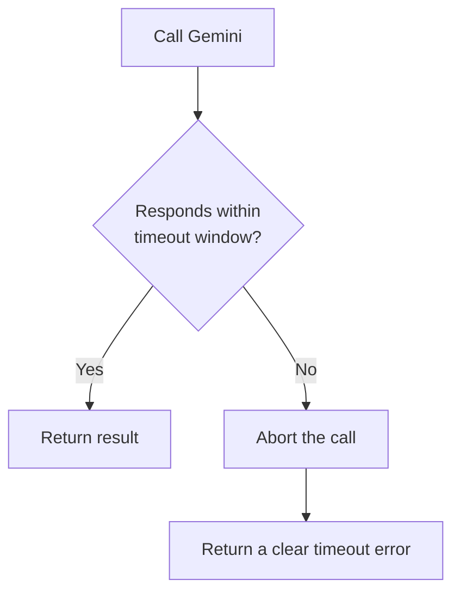

# 8. Timeouts

## What Is It?

If you ask someone a question and they just stand there silently, at some point you stop waiting and walk away rather than standing there forever. A timeout is ModeraAI doing that: if a call to Gemini takes too long, it gives up and returns a clear error, instead of leaving the caller hanging indefinitely.

## Why It Matters for AI Engineers

A hung request is worse than a failed one — it ties up an instance, a connection, and the caller's patience, all for an answer that may never come. Retries (topic 7) handle failures that happen *fast*; timeouts handle the failure that happens *slow* — the call that never technically errors, it just never finishes. Both are needed; neither replaces the other.

## Key Concepts

| Term | Definition |
|---|---|
| Client-side timeout | A limit set in the code calling Gemini (the `google-genai` SDK's `HttpOptions`) |
| Cloud Run request timeout | A platform-level ceiling on how long Cloud Run itself will wait for a response (configurable, default 300s) |
| Fail fast | The principle that a fast, clear failure is better than a slow, silent hang |

## How It Fits Together



## Hands-On

```python
from google.genai.types import HttpOptions

client = genai.Client(vertexai=True, http_options=HttpOptions(timeout=10000))  # 10s, in ms
```

```bat
REM Cloud Run's own backstop timeout, set at deploy time
gcloud run deploy moderaai --region=%REGION% --timeout=30

REM The built-in switch that deliberately stalls past the timeout
curl -X POST "%SERVICE_URL%/moderate?simulate_hang=true" -H "Content-Type: application/json" -d "{\"text\": \"test\"}"
```

## How We Test It

`main.py`'s `?simulate_hang=true` switch deliberately sleeps well past the configured timeout before it would otherwise call Gemini. Fire that request and time it with `curl -w "\nTime: %{time_total}s\n"` — instead of hanging indefinitely, the request is cut off and returns an error at (approximately) the configured timeout mark, not a moment later. Run it once with a short client timeout and once with it removed, so the difference between "fails fast" and "hangs" is visible side by side.

**Honest caveat, stated plainly to students:** the `google-genai` SDK's own `HttpOptions(timeout=...)` has documented reliability issues in some versions (it can silently pass `timeout=None` through to the underlying HTTP client). Don't over-promise it. The dependable backstop in this module is Cloud Run's own `--timeout` flag, which is enforced by the platform itself, independent of anything the SDK does correctly or not.

## Common Pitfalls

- Relying only on the SDK-level timeout and never setting Cloud Run's own `--timeout` — one honest backstop is worth more than one unreliable one
- Setting a timeout so short that normal, healthy Gemini calls get cut off — tune it against real observed latency, not a guess
- Confusing a timeout with a retry — a timed-out call isn't automatically retried unless you explicitly combine both (which this module's `main.py` does)

## Quick Recap

1. What's the difference between the kind of failure retries catch and the kind timeouts catch?
2. Why is Cloud Run's `--timeout` flag described as the "dependable backstop" in this topic?
3. What would happen to a caller if ModeraAI had retries but no timeout at all, and a call genuinely hung?
