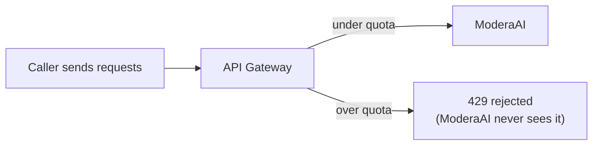

# 9. Rate Limiting

## What Is It?

A bouncer that lets everyone in at once isn't a bouncer — it's an open door. Rate limiting caps how many requests any one caller can make in a given time window (e.g. 10 per minute), so one abusive or buggy client can't flood ModeraAI and starve everyone else.

## Why It Matters for AI Engineers

Every request to ModeraAI triggers a real, billed Gemini call. Without a limit, one runaway script (a bug, a bot, or a bad actor) can generate an unbounded bill and starve real traffic — this is the topic that protects both your wallet and your other users at the same time. It's also the direct answer to the earlier question "does Google Cloud have a built-in gateway?" — yes, and this is where we use it.

## Key Concepts

| Term | Definition |
|---|---|
| API Gateway | A managed front door (from Module 15) that sits in front of your service |
| Quota | A declared limit — e.g. "10 requests per minute per calling project" |
| API key | How API Gateway identifies *which* calling project a request belongs to, so the quota has something to count against |
| `x-google-quota` | The OpenAPI extension used to declare a quota inside the spec |
| `429 Too Many Requests` | The standard HTTP status returned when a caller exceeds their quota |

## How It Fits Together



## Hands-On

`09_openapi_spec.yaml` (excerpt):

```yaml
x-google-management:
  metrics:
    - name: "moderate-requests"
      displayName: "Moderate Requests"
      valueType: INT64
      metricKind: DELTA
  quota:
    limits:
      - name: "moderate-limit"
        metric: "moderate-requests"
        unit: "1/min/{project}"
        values:
          STANDARD: 10
paths:
  /moderate:
    post:
      security:
        - api_key: []
      x-google-quota:
        metricCosts:
          moderate-requests: 1
securityDefinitions:
  api_key:
    type: "apiKey"
    name: "key"
    in: "query"
```

The `security: - api_key: []` block matters as much as the quota block itself — the quota's `{project}` unit is scoped per *calling* project, and an API key is how API Gateway knows which project is calling. No key requirement means no way to attribute usage to a caller, and the quota has nothing to count against.

```bat
09_api_gateway_rate_limit_setup.bat
```

That script also creates the API key itself (`gcloud services api-keys create`) — save the printed key into `00_setup_vars.bat`/`.env` as `API_KEY`.

## How We Test It

Reuse `load_test.py` (from topic 1) but point it at the **API Gateway URL** with `--api-key %API_KEY%`, not ModeraAI's direct Cloud Run URL, and fire more than 10 requests inside one minute:

```bat
python load_test.py --url %GATEWAY_URL% --requests 15 --api-key %API_KEY%
```

The first 10 succeed normally; requests beyond that come back as a real `429`, straight from API Gateway — and this is worth making explicit to students: check ModeraAI's own Cloud Run logs at the same time, and the rejected requests never show up there at all, because the gateway stopped them before they ever reached the service.

## Common Pitfalls

- Load-testing the direct Cloud Run URL instead of the API Gateway URL — the quota only applies at the gateway, so it'll look like rate limiting "isn't working"
- Forgetting the API key on the request entirely — without `?key=...`, the call is rejected as unauthenticated before the quota is even evaluated, which looks like rate limiting but isn't
- Setting the quota window (`1/min`) but not realizing it resets on a rolling or fixed window depending on configuration — verify which, don't assume
- Trying to hand-roll rate-limiting logic inside `main.py` first — API Gateway's declarative quota is the more realistic, less error-prone choice for this exact use case

## Quick Recap

1. Why does a `429` from API Gateway never show up in ModeraAI's own logs?
2. Why does the quota need an API key requirement to work at all, given the quota unit is `1/min/{project}`?
3. Why is a platform-level quota preferred here over custom rate-limiting code inside `main.py`?
