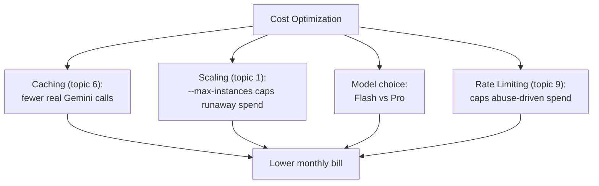

# 10. Cost Optimization

## What Is It?

Every dial this module has taught you — instance limits, caching, which model you call — is also, quietly, a cost dial. Cost optimization is the topic that stops treating those as separate concerns and looks at them as one thing: for the same quality of moderation, how do we spend the least money and time?

## Why It Matters for AI Engineers

AI calls are the single most expensive line item in a service like ModeraAI — far more than compute, storage, or networking. A service that "works" but costs 5x what it needs to isn't actually production-ready; billing anxiety is one of the top reasons AI projects get killed after launch. This topic closes the module by tying every earlier topic back to the number that ultimately decides whether a project survives: the bill.

## Key Concepts

| Term | Definition |
|---|---|
| Model tiering | Using a cheaper, faster model (Gemini Flash) instead of a pricier one (Gemini Pro) when quality allows |
| Cost per call | The actual $ cost of one Gemini request, driven by input/output tokens |
| Avoided call | A call that never happened because caching served a saved answer instead |
| Right-sizing | Setting `--max-instances`/`--min-instances` to match real traffic, not guesswork |

## How It Fits Together



## Hands-On

```python
# scripts/cost_comparison_demo.py — runs the same input through both models, prints token counts + estimated cost
```

```bat
python scripts/cost_comparison_demo.py
```

## How We Test It

Two concrete proofs, not estimates:

1. **Model comparison:** `scripts/cost_comparison_demo.py` sends the identical moderation request through `gemini-flash` and `gemini-pro`, printing each call's actual token usage (from the API response) and the resulting estimated cost side by side — students see the real cost gap, not a claimed one.
2. **Caching's real savings:** the script then replays a small batch of requests where roughly half are duplicates of earlier ones. A request counter (a simple in-memory or Firestore-backed counter incremented only on real Gemini calls, from topic 6) proves the number of *actual* Gemini calls is meaningfully lower than the number of *incoming* requests — the exact gap caching closed, shown as a number, not asserted.

Close by walking through the "which earlier topic is secretly also a cost control" list live: caching (fewer calls), `--max-instances` (spend ceiling), rate limiting (abuse ceiling), model choice (per-call price) — reinforcing that this topic isn't new work, it's a new lens on work already done.

## Common Pitfalls

- Defaulting to the biggest/priciest model "to be safe" without measuring whether the cheaper one is actually good enough for this task
- Treating cost optimization as a one-time exercise instead of something to re-check as usage patterns change
- Optimizing model cost while leaving `--max-instances` unset — a single dial left uncapped can dwarf every other saving

## Quick Recap

1. Name three topics from earlier in this module that double as cost controls, and how each one saves money.
2. Why does this topic measure real token counts and a real call counter instead of just estimating costs on paper?
3. Why might Gemini Pro still be the right choice for some tasks despite costing more than Flash?
